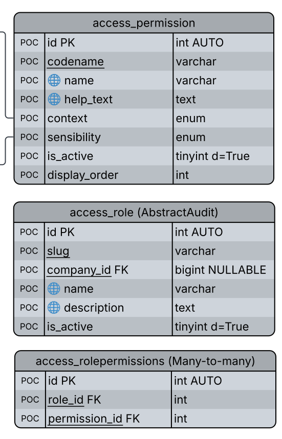
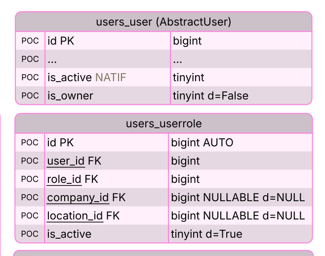

<div align="center">


# Sécurité des données et contrôle d'accès

Projet Gestion de stocks — document de conception


<h3>

[Sécurisation endpoints](#endpoints) | [Custom RBAC](#rbac) | [CompanyMiddleware](#midleware) | [CompanyScopedManager](#manager) | [Thread-Safety](#thread-safety)  | [Permissions](#permissions) | [Roles](#roles) | [Tests de sécurité](#tests)

</h3>

</div>

Ce document discute de la sécurité des données et du contrôle d'accès et présente la structure du système de contrôle d'accès basé sur les rôles (**RBAC - Role-Based Access Control**) personnalisé et les barrières de sécurité qui seront mises en place.

[← Analyse](3-choices-and-analysis.md) | [Sommaire](2-conception.md) |  [Modules →](5-django-apps-and-urls.md)

---

## Sécurisation des interfaces et des points d'accès <a id="endpoints"></a>

### Prévention des failles IDOR (Insecure Direct Object Reference) <a id="idor"></a>

Pour empêcher qu'un utilisateur n'accède aux données d'une autre entreprise en devinant ou en incrémentant les identifiants numériques dans les URLs (ex: `/products/42/`), le projet adopte une stratégie de double identification :

* **company_id + slug** : Un index unique composite composé de l'id d'entreprise et d'un slug. Utilisé pour les entités visibles (company, location, category, product). L'url utilisera alors le slug (ex: `/c/company-slug/product/product-slug`).
* **Clés publiques d'exposition (UUIDv4)** : Un champ `uuid` (`UUIDField`) aléatoire et unique pour les tables aux données sensibles ou moins exposées (ex: `/g/uuid`, `/c/company-slug/uuid`).

À noter que les table utilisent une **Clés primaires internes**, c'est à dire un `BigAutoField` auto-incrémenté classique, pour optimiser les performances des index et des jointures au niveau du SGDB.

### Protection contre les attaques par force brute (Authentication Rate Limiting)

Pour empêcher la découverte de mots de passe par force brute ou par dictionnaire (credential stuffing), l'application implémente un mécanisme de verrouillage dynamique :

* **Utilisation de `django-axes`** : Le projet intègre la librairie standard `django-axes` au niveau de la couche des middlewares.
* **Verrouillage hybride (IP + Username)** : Les tentatives infructueuses sont suivies à la fois par l'adresse IP source et par l'identifiant (email) soumis. Cela permet de bloquer un attaquant ciblé sans verrouiller l'accès de l'utilisateur légitime si celui-ci se connecte depuis un autre réseau.
* **Seuil de tolérance et refroidissement** : Après 5 tentatives de connexion échouées dans une fenêtre de 5 minutes, l'adresse IP concernée est temporairement bannie (HTTP 423) pour une durée configurable. Chaque événement de blocage est enregistré de manière immuable pour permettre une analyse de sécurité ultérieure.

---

## RBAC personnalisé <a id="rbac"></a>

Les permissions métier sont gérées par un système custom. Les modèles sont définis dans l'application `access` alors que le modèle permettant d'assigner un rôle à un utilisateur appartient à l'application `users`.

### Descriptions des modèles du contrôle d'accès




| table                    | Description                                                                                                                                                                                                                                                                                                                  |
|:------------------------ |:---------------------------------------------------------------------------------------------------------------------------------------------------------------------------------------------------------------------------------------------------------------------------------------------------------------------------- |
| `access_permission`      | Stocke les permissions fonctionnelles de l'application (ex:`codename = "inventory.movement.sale"`). Contrairement au CRUD global de Django, ces permissions décrivent des actions métiers précises.                                                                                                                          |
| `access_role`            | Regroupe un ensemble de permissions sous un identifiant unique<br/><br/>** Clé stratégique** : Le champ `company_id FK (NULLABLE)`. S'il est `NULL`, le rôle est **global** (ex: le rôle *Gestionnaire* existe pour toutes les entreprises). S'il est renseigné, le rôle est spécifique à une seule entreprise.              |
| `access_rolepermissions` | **Liste des permissions d'un rôle**<br/> Table d'association entre les permissions et les rôles. Permet de définir les permissions associées à chaque rôle.                                                                                                                                                                  |
| `access_log`             | **Audit** <br/>Enregistre de manière immuable chaque action de modification sur le système d'accès (création de rôle, changement de permissions). Elle utilise un champ `JSONField` (`changes`) pour stocker l'état avant/après pour garantir la traçabilité et des FK pour permettre la recherche / filtre plus facilement. |
| `users_userrole`         | **Table d'assignation**<br/> Cœur du système. Elle associe un utilisateur à un rôle, et y ajoute aussi un **scope (périmètre de validité)** :                                                                                                                                                                                |
| users_userrolelog        | **Audit**<br/>Même principe que pour access_log                                                                                                                                                                                                                                                                              |

#### Matrice de décision RBAC

##### Partie 1 : Permissions de type "Compagnie & Lieu" (`need_companycontext = True`)

| `access_permission .company_id` | `users_userrole .company_id` | `users_userrole .location_id` | Accès de l'utilisateur                                                                        |
| ------------------------------- | ---------------------------- | ----------------------------- | --------------------------------------------------------------------------------------------- |
| **NULL**                        | **NULL**                     | **NULL**                      | **Accès total** : Toutes les compagnies et toutes les locations.                              |
| **NULL**                        | **X**                        | **NULL**                      | **Accès restreint** : Compagnie X seulement, sans restriction de location.                    |
| **NULL**                        | **X**                        | **A**                         | **Accès restreint** : Compagnie X seulement, et uniquement pour la location A et ses enfants. |
| **NULL**                        | **NULL**                     | **A**                         | **Incohérent / Refusé** : Un lieu ne peut pas être validé sans contexte de compagnie.         |
|                                 |                              |                               |                                                                                               |
| **X**                           | **NULL**                     | **NULL**                      | **Accès restreint** : Compagnie X seulement, sans restriction de location.                    |
| **X**                           | **X**                        | **NULL**                      | **Accès restreint** : Compagnie X seulement, sans restriction de location.                    |
| **X**                           | **X**                        | **A**                         | **Accès restreint** : Compagnie X seulement, et uniquement pour la location A et ses enfants. |
| **X**                           | **NULL**                     | **A**                         | **Accès restreint** : Compagnie X seulement, et uniquement pour la location A et ses enfants. |
|                                 |                              |                               |                                                                                               |
| **X**                           | **Y**                        | *Peu importe*                 | **Refusé** : La compagnie active ne peut pas être X et Y à la fois.                           |

1. Les lignes où `permission.company_id = X` et `userrole.company_id = NULL` (ou vice-versa) fonctionnent comme un **entonnoir** : c'est la restriction la plus sévère qui l'emporte toujours.
2. Si un `userrole.location_id` est présent, la validation du lieu s'enclenche **uniquement** si la compagnie a d'avance été validée avec succès.

##### Partie 2 : Permissions de type "Global" (`need_globalcontext = True`)

| `access_permission .company_id` | `users_userrole .company_id` | `users_userrole .location_id` | Accès de l'utilisateur                                                                                                   |
| ------------------------------- | ---------------------------- | ----------------------------- | ------------------------------------------------------------------------------------------------------------------------ |
| **NULL**                        | **NULL**                     | **NULL**                      | **Accès accordé** : L'action globale est autorisée car l'utilisateur a un rôle global (sans restriction).                |
| **NULL**                        | **X**                        | *Peu importe*                 | **Refusé** : L'action requiert un pouvoir global, mais l'utilisateur est restreint à la compagnie X.                     |
| **NULL**                        | *Peu importe*                | **A**                         | **Refusé** : L'action requiert un pouvoir global, mais l'utilisateur est restreint au lieu A.                            |
| **X**                           | *Peu importe*                | *Peu importe*                 | **Refusé** : Configuration impossible en BDD (Une action globale ne peut pas être rattachée à une compagnie spécifique). |

---

### Vérification des permissions

**Le système de permissions natif de Django est conçu pour être étendu et remplacé** grâce à un mécanisme appelé les **Authentications Backends**. Ainsi, la question des permissions du Custom RBAC peut être répondu avec `user.has_perm()` avec, en coulisse, un arbre de décision custom. 

La question:

```text
Cet utilisateur peut-il effectuer cette action dans ce contexte et ce périmètre?
```

#### Arbre de décision

```text
[ Début ] ──> L'utilisateur est-il inactif ? ──[Oui]──> RETOURNER FAUX
                 │
                 └──[Non]──> Est-il Owner ? ──[Oui]──> RETOURNER VRAI (Bypass complet)
                                │
                                └──[Non]
                                     ▼
                      [ Trouver la Permission demandée ]
                                     │
                                     ├── Introuvable OU `is_active == False` ──> RETOURNER FAUX
                                     ▼
                        [ Boucle sur chaque UserRole ]
                                     │
                         `is_active == False` OU rôle associé inactif ──> Passer au suivant
                                     │
                                     ▼
                  Quels sont les besoins de la Permission ?
                    ├── Global  ──> L'assignation doit être 100% vide (Compagnie = NULL, Lieu = NULL)
                    └── Company ──> La Compagnie matche-t-elle le contexte ?
                                       │
                                       └── [Oui] ──> Le Lieu matche-t-il (ou est-il un enfant) ?
                                       │                │
                                       │                └── [Oui] ──> RETOURNER VRAI                 
                                       │
                                       └── [Non] ──> RETOURNER FAUX
```

#### Backend d'Authentification personnalisé

```python
# django-stock/src/access/backends.py

from django.db.models import Prefetch
from django.core.exceptions import ObjectDoesNotExist
# Importez les modèles ici (UserRole, AccessPermission, CompanyLocation, etc.)

class CompanyRBACBackend:
    """
    Backend de permission personnalisé pour gérer le RBAC par Compagnie et Lieu.
    """

    def authenticate(self, request, username=None, password=None, **kwargs):
        # On ne gère pas l'authentification (login) dans ce backend, 
        # on retourne None pour laisser les autres backends s'en charger.
        return None

    def has_perm(self, user_obj, perm, obj=None):
        """
        Surcharge la vérification des permissions.
        :param user_obj: L'instance de l'utilisateur connecté.
        :param perm: Le codename string de la permission (ex: 'catalogue.product.delete').
        :param obj: Un dictionnaire optionnel contenant le contexte : 
                    {"company_id": X, "location_id": Y}
        """
        # 1. Protection & Fast-Bypass
        if not user_obj or not user_obj.is_active:
            return False

        if getattr(user_obj, 'is_owner', False):
            return True

        # 2. Détermination automatique du contexte de compagnie
        context_company_id = None
        context_location_id = None

        if isinstance(obj, dict):
            context_company_id = obj.get('company_id')
            context_location_id = obj.get('location_id')
        else:
            # Récupération automatique depuis le CompanyContext (Thread-Safe)
            current_company = CompanyContext.get()
            if current_company:
                context_company_id = current_company.id
        
            # Si obj est directement une instance de modèle "Location", on extrait son ID
            if hasattr(obj, 'location_id'): # Si c'est un objet possédant un lieu (ex: Stock)
                context_location_id = obj.location_id
            elif hasattr(obj, 'path'): # Si obj est directement l'instance de CompanyLocation
                context_location_id = obj.id

        # 3. Récupération TOUT-EN-UN (Filtres is_active inclus)
        user_roles = UserRole.objects.filter(
            user_id=user_obj.id,
            is_active=True,         # Validation de l'assignation active
            role__is_active=True    # Validation du rôle actif
        ).select_related(
            'role', 
            'location'
        ).prefetch_related(
            Prefetch(
                'role__permissions',
                queryset=AccessPermission.objects.filter(codename=perm, is_active=True), # Permission active
                to_attr='matching_permissions'
            )
        )

        if not user_roles:
            return False

        context_location_path = None

        # 4. Évaluation en mémoire Python
        for user_role in user_roles:
            role = user_role.role

            if not role.matching_permissions:
                continue

            permission = role.matching_permissions[0] # Récupère la perm de la liste to_attr

            # --- CAS CONTEXTE GLOBAL ---
            if permission.need_globalcontext and not permission.need_companycontext:
                if user_role.company_id is None and user_role.location_id is None:
                    return True
                continue

            # --- CAS CONTEXTE COMPAGNIE ---
            elif permission.need_companycontext:
                if context_company_id is None:
                    continue

                company_access_granted = False

                if role.company_id is None and user_role.company_id is None:
                    company_access_granted = True

                elif role.company_id is not None:
                    if role.company_id == context_company_id:
                        if user_role.company_id is None or user_role.company_id == context_company_id:
                            company_access_granted = True

                elif role.company_id is None and user_role.company_id is not None:
                    if user_role.company_id == context_company_id:
                        company_access_granted = True

                if not company_access_granted:
                    continue

                # --- ÉTAPE B : VALIDATION DU PÉRIMÈTRE LOCATION ---
                if user_role.location_id is None:
                    return True 

                if context_location_id is not None:
                    if user_role.location_id == context_location_id:
                        return True

                    if user_role.location and user_role.location.path:
                        if context_location_path is None:
                            try:
                                context_location_path = CompanyLocation.objects.values_list('path', flat=True).get(id=context_location_id)
                            except CompanyLocation.DoesNotExist:
                                context_location_path = ""

                        parent_path = user_role.location.path
                        if context_location_path.startswith(parent_path) and len(context_location_path) > len(parent_path):
                            return True

        return False
```

##### Enregistrer le Backend dans `settings.py`

```python
# django-stock/src/config/settings.py

AUTHENTICATION_BACKENDS = [
    'django.contrib.auth.backends.ModelBackend', # Le backend par défaut de Django
    'mon_projet.authentication.backends.CompanyRBACBackend', # Votre nouveau backend
]
```

##### Dernière étape d'optimisation de CompanyRBACBackend: cache applicatif

Si la méthode consomme encore trop de ressources lors de pics de charge, l'étape ultime consiste à mettre le résultat de cette fonction dans le **Cache de Django** (`django.core.cache`) avec une clé unique basée sur l'utilisateur et le contexte :

```python
f"rbac_{user.id}_{permission_codename}_{context_company_id}_{context_location_id}"
```

Il faudra penser à invalider (supprimer) cette clé de cache à chaque fois qu'un objet de la table `UserRole` est modifié ou supprimé (via un signal Django `post_save` / `post_delete`).

##### Application dans les Vues Django :

```python
# Exemple 1 : Vérification d'une action globale
# Pas besoin de passer de contexte
if user.has_perm('core.settings.change'):
    print("Accès accordé au panneau global !")

# Exemple 2 : Vérification d'une action métier (need_companycontext=True) :
contexte = {
    "company_id": current_company.id, 
    "location_id": current_location.id
}

if user.has_perm('catalogue.product.delete', obj=contexte):
    print("L'utilisateur a le droit de supprimer ce produit dans cette filiale.")
else:
    raise PermissionDenied()
```

Ou, encore mieux, créer un décorateur de vue personnalisé, dans un mixin!

###### Mixin

```python
# django-stock/access/mixins.py

from django.contrib.auth.mixins import AccessMixin
from django.core.exceptions import PermissionDenied

class RBACRequiredMixin(AccessMixin):
    """
    Mixin pour les Class-Based Views de Django.
    Vérifie si l'utilisateur possède la permission RBAC requise.
    """
    # Attribut à définir obligatoirement dans vos vues
    permission_codename = None 

    def dispatch(self, request, *args, **kwargs):
        # 1. Sécurité de développement : s'assurer que le développeur a configuré le codename
        if self.permission_codename is None:
            raise NotImplementedError(
                f"{self.__class__.__name__} requiert la définition de l'attribut 'permission_codename'."
            )

        # 2. Vérifier si l'utilisateur est connecté et actif
        if not request.user.is_authenticated or not request.user.is_active:
            return self.handle_no_permission()

        # 3. Appel de la méthode user.has_perm native (qui utilise le backend personnalisé)
        # Le CompanyContext est déjà alimenté par le CompanyMiddleware à ce stade de la requête.
        if not request.user.has_perm(self.permission_codename):
            raise PermissionDenied("Vous n'avez pas les droits nécessaires pour accéder à cette ressource.")

        # 4. Si tout est valide, on laisse Django continuer le cycle normal de la vue (dispatch)
        return super().dispatch(request, *args, **kwargs)
```

###### Utilisation

```python
# django-stock/catalogue/views.py

from django.views.generic import DeleteView
from django.urls import reverse_lazy
from src.access.mixins import RBACRequiredMixin
from .models import Product

class ProductDeleteView(RBACRequiredMixin, DeleteView):
    model = Product
    template_name = 'catalogue/product_confirm_delete.html'
    success_url = reverse_lazy('product_list')
    
    # LA ligne magique : le mixin s'occupe de tout le reste !
    permission_codename = 'catalogue.product.delete'
    
    def get_object(self, queryset=None):
        """
        Le CompanyScopedManager filtre déjà les produits de la compagnie courante.
        On récupère l'objet de manière sécurisée.
        """
        return super().get_object(queryset)
```


---

## CompanyMiddleware <a id="middleware"></a>

`CompanyMiddleware `sert à établir le **contexte d'entreprise courante** pour les URLs company-scoped

**Responsabilités**:

1. détecter les URLs contenant un slug d'entreprise (/c/<company_slug>/...) ;
2. charger la compagnie correspondante
3. vérifier que la compagnie est active ;
4. vérifier que l’utilisateur peut accéder à cette compagnie :
   * si user est inactif : refuser l'accès ;
   * si user est owner : autoriser l'accès ;
   * sinon : vérifier le scope RBAC pour cette entreprise ;
5. attacher la compagnie à la requête :

```python
   request.company = company
```

6. définir le contexte utilisé par `CompanyScopedManager `;
7. nettoyer ce contexte après la requête.

`CompanyMiddleware` vérifie l'accès à la compagnie mais il ne remplace pas les permissions métier granulaires. Les actions comme modifier un produit, ajuster un stock ou créer un employé doivent être validées par le `PermissionService`.

---

## CompanyScopedManager <a id="manager"></a>

Le rôle du `CompanyScopedManager` est de filtrer les données selon l'entreprise active (ou contexte courant).

Ainsi,

```python
Product.objects.all()
```

dans l'url `/c/company-a/products/` retournera seulement les produits de l'entreprise dont le slug est *company-a*. À noter qu'une vue *company-scoped* reste *company-scoped* même pour le propriétaire (qui a le droit de tout voir mais à partir d'autres vues).

Les vues globales owner doivent utiliser des accès explicites et protégés, et non contourner implicitement le filtrage dans les vues company-scoped.

---

### Isolation hermétique du contexte d'entreprise (Thread-Safety) <a id="thread-safety"></a>

Le projet utilise un modèle de base de données partagée où le filtrage repose sur le code applicatif (`CompanyScopedManager`). Pour éviter tout risque de fuite de données en mémoire entre deux requêtes simultanées de clients différents (Thread Context Bleeding), le stockage de la compagnie active respecte les règles suivantes :

1. **Bannissement des variables globales** : Aucune variable globale ou attribut de classe statique n'est utilisé pour stocker l'entreprise ou l'utilisateur connecté.
2. **Utilisation de `contextvars`** : Le `CompanyMiddleware` utilise le module natif `contextvars` de Python (via un conteneur thread-safe) pour isoler la compagnie active au sein du cycle de vie unique de la requête HTTP en cours.
3. **Cycle de vie strict (Nettoyage)** : À la fin de chaque cycle de requête/réponse (dans le bloc `finally` du middleware), le contexte est explicitement réinitialisé. Cela garantit qu'un thread de serveur web (comme Gunicorn ou uWSGI) réutilisé pour un autre client redémarre avec une mémoire totalement vierge de toute information d'entreprise précédente.

```python
import contextvars

# Ce conteneur est isolé par thread et par tâche asynchrone
_current_company = contextvars.ContextVar("current_company", default=None)

class CompanyContext:
    @staticmethod
    def set(company):
        _current_company.set(company)

    @staticmethod
    def get():
        return _current_company.get()

    @staticmethod
    def clear():
        _current_company.set(None)
```

Le code dans CompanyMiddleware: appel de `CompanyContext.set(company)` au début et `CompanyContext.clear()` dans un bloc `finally`.

---

## Référentiel des permissions <a id="permissions"></a>

Les permissions sont créées lors de la configuration initiale de l'application.

Les permissions suivent le modèle suivant: *[app_name].[model_name].[OPT context][perm_type]*.

- *perm_type* reprend les CRUD officiels de django (`view`, `add`, `change`, delete`) `et les étend en les regroupant parfois l (ex: `manage`) ou en ciblant un champs spécifique (ex: `activate `dans `users.user.activate`  permet de mettre le field `is_active `de l'utilisateur à vrai)
- *model_name* est parfois sauté car la permission concerne plusieurs tables (ex: `access.manage` permet de faire des changements dans les tables `access_role `et `access_rolepermissions`)
- *context* est optionnel et est utilisé pour quelques permissions (ex: `company.location.main.add` et `company.location.sub.add` permettent respectivement de créer (ou non) des emplacements de haut niveau (`parent_id `= NULL) et des emplacements de sous-location (`parent_id` = ID de la location parent)

> [!TIP]
> *Les fonctionnalités sous-jacentes à chaque permission seront implémentées à différents stades du développement. Certaines permissions sont projetées mais pourraient être codé différemment selon l'évolution du produit et de l'UX.*

#### Contexte requis

Défini si le périmètre de la permission est `global `ou `company-scoped`. Les libellés NEVER et owner sont aussi utilisés pour décrire qui peut réaliser l'action décrite.

| Périmètre | Description                                                                                 |
|:--------- |:------------------------------------------------------------------------------------------- |
| global    | La permission s'applique dans un contexte multi-entreprises (owner ou employé de haut rang) |
| company   | La permission s'applique exclusivement dans un contexte d'entreprise active.                |

#### Sensibilité

À noter que le propriétaire a accès à toutes les permissions sans besoin d'y être explicitement assigné via un rôle (*bypass* direct), peu importe la sensibilité.

| Périmètre  | Description                                                                                                                                                |
|:---------- |:---------------------------------------------------------------------------------------------------------------------------------------------------------- |
| normal     | La permission s'applique dans un contexte multi-entreprises (owner ou employé de haut rang)                                                                |
| owner      | La permission est normalement accessible uniquement au propriétaire (`user.is_owner = True`) mais peut être déléguée par permission si associée à un rôle. |
| owner-only | La permission est très sensible mais peut être déléguée par permission si associée à un rôle.                                                              |

#### Permission barrée

Cette permission ne sera **PAS** créée car

1. elle est bloquée / impossible pour tous les utilisateurs métier OU
2. elle est listée /  groupée sous un autre nom.

La permission est listée dans le référentiel à des fins de documentation. Il s'agit d'une permission CRUD django standard.

### 5.1.  Core (`core.*`)

Centralise les configurations globales du système.

| Code (`codename`)          | Description (`name`)                                                                                                                                                                                                                                                                              | Contexte requis                                                                                                                                                                                                                                                                           | Sensibilité |
|:-------------------------- |:------------------------------------------------------------------------------------------------------------------------------------------------------------------------------------------------------------------------------------------------------------------------------------------------- |:-----------------------------------------------------------------------------------------------------------------------------------------------------------------------------------------------------------------------------------------------------------------------------------------:|:-----------:|
| ~~`core.settings.add`~~    | Ajouter une configuration globale.*La table core.settings ne contient qu'un seul enregistrement.*                                                                                                                                                                                                 | -                                                                                                                                                                                                                                                                                         | -           |
| `core.settings.view`       | Consulter les configurations globales                                                                                                                                                                                                                                                             | global                                                                                                                                                                                                                                                                                    | owner-only  |
| `core.settings.change`     | Modifier les configurations globales                                                                                                                                                                                                                                                              | global                                                                                                                                                                                                                                                                                    | owner-only  |
| ~~`core.settings.delete`~~ | Supprimer les configuration globales.*La table core.settings doit contenir un seul enregistrement.*                                                                                                                                                                                               | -                                                                                                                                                                                                                                                                                         | -           |
| ~~`core.image.view`~~      | Voir une image téléversée sur le serveur. Cette permission n'est pas créée car voir une image est associée au modèle correspondant: si l'utilisateur a le droit de voir le modèle, alors il peut aussi voir les images qui lui sont associées.                                                    | -                                                                                                                                                                                                                                                                                         | -           |
| `core.image.[add           | change]`                                                                                                                                                                                                                                                                                          | Téléverser des images sur le serveur. Le contexte dépend à quel modèle l'image sera associée. Avoir cette permission n'est utile qu'en association de la permission pour gérer le modèle correspondant.<br/>Note: La permission concerne tous les types d'images pouvant être téléversées | aucun       |
| `core.image.delete`        | Supprimer une image téléverser sur le serveur. Le contexte dépend à quel modèle l'image sera associée. Avoir cette permission n'est utile qu'en association de la permission pour gérer le modèle correspondant.<br/>Note: La permission concerne tous les types d'images pouvant être supprimées | aucun                                                                                                                                                                                                                                                                                     | normal      |

### 5.2.  Users (`users.*`)

Gère les profils utilisateurs et leur accès.

| Code de permission                                                                       | Description                                                                                                                                                                                                                                                                                                                                                                                                                                                            | Périmètre          |
|:---------------------------------------------------------------------------------------- |:---------------------------------------------------------------------------------------------------------------------------------------------------------------------------------------------------------------------------------------------------------------------------------------------------------------------------------------------------------------------------------------------------------------------------------------------------------------------- | ------------------ |
| `users.add`                                                                              | Créer un nouvel utilisateur dans le système.<br/> - Le champs `is_owner `est bloqué et fixé à False en tout temps.                                                                                                                                                                                                                                                                                                                                                     | global             |
| users.user.invite                                                                        | Inviter un utilisateur à créer son propre compte à partir d'un courriel contenant un lien sécurisé                                                                                                                                                                                                                                                                                                                                                                     | global             |
| `users.user.view`                                                                        | Voir la liste des utilisateurs<mark>TODO</mark>. Comment faire en sorte qu'un gestionnaire (par exemple) voit seulement la liste des utilisateurs affectés à son secteur d'activité?                                                                                                                                                                                                                                                                                   | global             |
| `users.user.change`                                                                      | Modifier les informations ou préférences de n'importe quel utilisateur, exluant le statut d'activation du compte (`user.is_active`) et le drapeau propriétaire (`user.is_owner`)<br/> <mark>TODO</mark>. Comment permettre à un gestionnaire de modifier seulement les utilisateurs de son entreprise et/ou de sa location ? Il faudrait vérifier les permissions de tous les employés et filtrer ceux qui sont dans le (s) même(s) périmètre(s)  que lui (possible ?) | global             |
| `users.user.change_own`                                                                  | Modifier les informations et préférences de son propre profil (exclut les champs`user.is_active` et `user.is_owner`)                                                                                                                                                                                                                                                                                                                                                   | global             |
| `users.user.delete`                                                                      | Supprimer un utilisateur (le système refusera si au moins une référence à cet utilisateur existe)                                                                                                                                                                                                                                                                                                                                                                      | global             |
| `users.user.activate`                                                                    | Réactiver le compte d'un utilisateur (set`user.is_active = True`)                                                                                                                                                                                                                                                                                                                                                                                                      | global             |
| `users.user.inactivate`                                                                  | Désactiver le compte d'un utilisateur d'un utilisateur (set`user.is_active = False`)                                                                                                                                                                                                                                                                                                                                                                                   | global             |
| ~~`users.userrole.add`~~<br/>~~`users.userrole.change`~~<br/>~~`users.userrole.delete`~~ | Assigner, modifier ou supprimer les rôles d'un utilisateur. Regroupement sous une seule permission`users.userrole.manage`                                                                                                                                                                                                                                                                                                                                              | NEVER              |
| `users.userrole.view`                                                                    | Consulter les rôles assignés à une liste d'utilisateurs (<mark>TODO</mark>: idem questionnement que pour user.view)                                                                                                                                                                                                                                                                                                                                                    | global             |
| `users.userrole.manage`                                                                  | Assigner, modifier ou supprimer les rôles assignés à un utilisateur. (<mark>TODO</mark>: idem questionnement que pour user.change) <mark>Autre TODO IMPORTANT: </mark> Un utilisateur avec cette permission ne doit pas pouvoir assigner des permissions qu'il n'a pas lui-même.                                                                                                                                                                                       | global             |
| users.userrolelog.view                                                                   | Voir l'historique des modifications sur les assignations de rôle                                                                                                                                                                                                                                                                                                                                                                                                       | global, owner-only |
| ~~`users.userrolelog.[add                                                                | change                                                                                                                                                                                                                                                                                                                                                                                                                                                                 | delete]`~~         |

### 5.3.  Company (`company.*`)

Pilote les entreprises et cartographie l'infrastructure physique (location, sous-locations et types de location).

| Code de permission                                     | Description                                                                                                                                                                                                                                                                      | Périmètre           |
|:------------------------------------------------------ |:-------------------------------------------------------------------------------------------------------------------------------------------------------------------------------------------------------------------------------------------------------------------------------- |:------------------- |
| `company.company.view`                                 | Voir les informations de configuration de l'entreprise.                                                                                                                                                                                                                          | company             |
| ~~`company.company.add`~~                              | Créer une nouvelle entreprise.                                                                                                                                                                                                                                                   | owner-only          |
| ~~`company.company.change`~~                           | Modifier les informations de l'entreprise, exluant l'archivage.                                                                                                                                                                                                                  | company, OWNER-ONLY |
| ~~`company.company.archive`~~                          | Archiver ou désarchiver l'entreprise<br/>Une entreprise archivée `(is_archive = True`) n'est plus disponible pour aucune action (création de produit, modification d'inventaire, etc) et n'apparaît plus dans le tableau de bord et les rapports [Est en consultation seulement] | company, OWNER-ONLY |
| ~~`company.company.delete`~~                           | Supprimer une entreprise.  Cette action est irréversible et supprime l'entreprise, toutes les références et tout l'historique associé à l'entreprise.                                                                                                                            | company, OWNER-ONLY |
| ~~`company.locationtype.[view, add, change, delete]`~~ | Ajouter, modifier et supprimer les types de location.*Géré  par `company.locationtype.manage`* et  *seulement voir les locationtype n'est pas pertinent.*                                                                                                                        | NEVER               |
| `company.locationtype.manage`                          | Gérer les types de location (ajouter, modifier et supprimer)                                                                                                                                                                                                                     | company, owner      |
| `company.location.view`                                | Consulter la cartographie hiérarchique des emplacements                                                                                                                                                                                                                          | company             |
| `company.location.main.add`                            | Créer un emplacement de haut niveau (emplacement racine) et définir son adresse, son type et ses paramètres.                                                                                                                                                                     | company, owner      |
| `company.location.main.change`                         | Modifier les informations d'un emplacement de haut niveau (type, nom, adresse,    , etc).                                                                                                                                                                                        | company, owner      |
| `company.location.main.delete`                         | Supprimer un emplacement de haut niveau (emplacement racine). Le système empêchera la suppression si des références à cet emplacement existe (stock)                                                                                                                             | company, owner      |
| ~~`company.location.sub.[view                          | add                                                                                                                                                                                                                                                                              | change              |
|                                                        |                                                                                                                                                                                                                                                                                  |                     |
| `company.location.sub.manage`                          | Gérer les sous-locations (emplacements enfants). À la création / mise à jour, le système doit vérfier que le parent choisi appartient bien à la même entreprise. Aussi, le système empêchera la suppression si des références (stock) y font référence.                          | company             |
| company.import                                         | Importer massivement les données d'une entreprise, incluant les infos de locations, le catalogue et l'inventaire (CSV).<mark>TODO </mark>Comment gérer si la company contient déjà des données?                                                                                  | company, owner      |
| company.export                                         | Exporter les données d'une entreprise, incluant les infos de locations, le catalogue et l'inventaire (CSV).                                                                                                                                                                      | company, owner      |

### 5.4.  Catalogue (`catalogue.*`)

Structure le référentiel des articles disponibles à la gestion de stock.

| Code de permission          | Description                                                                                                                                                                                                      | Périmètre  |
|:--------------------------- |:---------------------------------------------------------------------------------------------------------------------------------------------------------------------------------------------------------------- |:---------- |
| `catalogue.product.view`    | Consulter le catalogue des produits (inclut les infos des modèles de produit, leurs variantes. leurs catégories et leurs images associées. Exlut les infos de configuration).                                    | company    |
| `catalogue.product.add`     | Créer un nouveau produit (inclut les modèles de produit, leurs variantes. leurs catégories et leurs images associées. Exclut la les infos de configuration et l'archivage).                                      | company    |
| `catalogue.product.change`  | Modifier les caractéristiques d'une fiche produit (inclut les modèles de produit, leurs variantes. leurs catégories et leurs images associées. Exclut la mise à jour des infos de configuration et l'archivage). | company    |
| `catalogue.product.archive` | Archiver ou désarchiver un produit.*Un modèle archivé va archiver toutes ses variantes. Une variante archivée n'affecte pas son modèle.*                                                                         | company    |
| `catalogue.product.delete`  | Supprimer définitivement un produit du catalogue de l'entreprise.*Le système bloquera la suppression si des référence au produit existe.*                                                                        | company    |
| `catalogue.category.view`   | Consulter l'arborescence complète des catégories.                                                                                                                                                                | company    |
| ~~`catalogue.category.[add  | change                                                                                                                                                                                                           | delete]`~~ |
| `catalogue.category.manage` | Modifier ou réorganiser la hiérarchie des catégories. Le système bloquera la suppression d'une catégorie référencée dans les produits                                                                            | company    |

### 5.5.  Inventory (`inventory.*`)

Gère l'état des stocks réels et encadre rigoureusement les modifications aux quantités  en inventaire.

| Code de permission                                                                                                                                                                                                                                                                                                                                                                                                                                                                                                                                                                                                                                                                             | Description                                                                                                        | Périmètre (context et is_sensible) |
|:---------------------------------------------------------------------------------------------------------------------------------------------------------------------------------------------------------------------------------------------------------------------------------------------------------------------------------------------------------------------------------------------------------------------------------------------------------------------------------------------------------------------------------------------------------------------------------------------------------------------------------------------------------------------------------------------- |:------------------------------------------------------------------------------------------------------------------ |:---------------------------------- |
| ~~`inventory.uom.[view                                                                                                                                                                                                                                                                                                                                                                                                                                                                                                                                                                                                                                                                         | add                                                                                                                | change                             |
| `inventory.uom.manage`                                                                                                                                                                                                                                                                                                                                                                                                                                                                                                                                                                                                                                                                         | Gérer les unités de mesure utilisés dans l'inventaire.                                                             | company                            |
| `inventory.stock.view`                                                                                                                                                                                                                                                                                                                                                                                                                                                                                                                                                                                                                                                                         | Consulter les niveaux de stock disponibles par emplacement.                                                        | company                            |
| `inventory.movement.view`                                                                                                                                                                                                                                                                                                                                                                                                                                                                                                                                                                                                                                                                      | Consulter le journal historique des mouvements de stock.                                                           | company                            |
| ~~`inventory.movement.[add                                                                                                                                                                                                                                                                                                                                                                                                                                                                                                                                                                                                                                                                     | change                                                                                                             | delete]`~~                         |
| ~~`inventory.stock.[add                                                                                                                                                                                                                                                                                                                                                                                                                                                                                                                                                                                                                                                                        | change                                                                                                             | delete]`~~                         |
| ~~`inventory.movementreason.[view                                                                                                                                                                                                                                                                                                                                                                                                                                                                                                                                                                                                                                                              | add                                                                                                                | change                             |
| <a id="permissions-reasons"></a>`inventory.movementreason.manage`                                                                                                                                                                                                                                                                                                                                                                                                                                                                                                                                                                                                                              | Gérer les raisons pour modifier les quantités en inventaire.                                                       | company,  owner                    |
| `inventory.movementreason.increase`<br/>*Permet tous les mouvements d'augmentation d'inventaire peu importe leur raison.*<br/>Ex:<br/>*- stock.quantity est augmenté*<br/>*- un movement est créé avec location_source NULL et location_dest NULL*                                                                                                                                                                                                                                                                                                                                                                                                                                             | Augmenter l'inventaire (permission générique)                                                                      | company, movementreason            |
| `inventory.movementreason.decrease`<br/>*Permet tous les mouvements de diminution d'inventaire, peu importe la raison.*<br/>Ex:<br/>*- stock.quantity est diminué*<br/>*- un movement est créé avec location_source NULL et location_dest NULL*                                                                                                                                                                                                                                                                                                                                                                                                                                                | Diminuer l'inventaire (permission générique)                                                                       | company, movementreason            |
| `inventory.movementreason.purchase`<br/>*Ex: T-Shirt d'un fournisseur est reçu dans la zone de réception de marchandises.*<br/>*- stock.quantity est augmenté*<br/>*- un movement est créé avec location_source NULL et location_dest qui pointe vers la location modifiée.*                                                                                                                                                                                                                                                                                                                                                                                                                   | Augmenter l'inventaire en raison d'une commande d'achat à un fournisseur.                                          | company, movementreason            |
| `inventory.movementreason.manufacture`<br/>*Ex: T-Shirt sort de la fabrique et est stocké dans l'entrepôt.*<br/>*- stock.quantity est augmenté*<br/>*- un movement est créé avec location_source NULL et location_dest qui pointe vers la location modifiée.                                                                                                                                                                                                                                                                                                                                                                                                                                   | Augmenter l'inventaire en raison de l'arrivée de produits issues d'une chaîne de production interne.               | company, movementreason            |
| `inventory.movementreason.sale`<br/>*Ex: T-Shirt est vendu.*<br/>*- stock.quantity est diminué*<br/>*- un movement est créé avec location_source pointant vers la location modifié et location_dest NULL.                                                                                                                                                                                                                                                                                                                                                                                                                                                                                      | Diminuer l'inventaire en raison d'une vente.                                                                       | company, movementreason            |
| `inventory.movementreason.count_more`<br/>*Ex: Le nombre de T-Shirt sur l'étagère A est plus élevé que la quantité indiquée en inventaire.*<br/>*- stock.quantity est augmenté*<br/>*- un movement est créé avec location_source et location_dest pointant vers la location modifiée.*                                                                                                                                                                                                                                                                                                                                                                                                         | Augmenter l'inventaire en raison d'un ajustement de décompte d'inventaire.                                         | company, movementreason            |
| `inventory.movementreason.count_less`<br/>*Ex: Le nombre de T-Shirt sur l'étagère B est plus basse que la quantité indiquée en inventaire.*<br/>*- stock.quantity est diminué*<br/>*- un movement est créé avec location_source et location_dest pointant vers la location modifiée.*                                                                                                                                                                                                                                                                                                                                                                                                          | Diminuer l'inventaire en raison d'un ajustement de décompte d'inventaire.                                          | company, movementreason            |
| `inventory.movementreason.loss`<br/>*Ex: Un T-Shirt sur l'étagère C est déchiré et donc retiré du stock courant.*<br/>*- stock.quantity est diminué*<br/>*- un movement est créé avec location_source pointant vers la location modifié et location_dest est NULL.*                                                                                                                                                                                                                                                                                                                                                                                                                            | Diminuer l'inventaire en raison de marchandises perdues (bris, vol, date de péremption dépassé, etc).              | company, movementreason            |
| `inventory.movementreason.uom_pack`<br/>*Ex: 10 T-Shirt sont retirés de la tablette et placer dans une boîte pour une vente par pack plutôt que unitaire.*<br/>*- stock.quantity avec uom unit unit est diminué* <br/>*- stock.quantity avec uom unit pack est augmenté* <br/>*- un movement est créé avec location_source du premier changement et location_dest du deuxième changement. quantity_delta est 0.*                                                                                                                                                                                                                                                                               | Diminuer l'inventaire en raison d'un changement d'unité de mesure.                                                 | company, movementreason            |
| `inventory.movementreason.uom_unpack`<br/>*Ex: 10 T-Shirt sont retirés d'une boîte de fournisseur et placer sur la tablette pour renflouer l'emplacement.*<br/>*- stock.quantity avec uom unit parck est augmenté* <br/>*- stock.quantity avec uom unit unit est diminué* <br/>*- un movement est créé avec location_source du premier changement et location_dest du deuxième changement. quantity_delta est 0.*                                                                                                                                                                                                                                                                              | Augmenter l'inventaire en raison d'un changement d'unité de mesure.                                                | company, movement reason           |
| `inventory.movementreason.relocate`<br/>*Ex: 1 T-Shirt est déplacé de l'emplacement Tablette A et placé dans l'emplacement  Lift 12.*<br/>*- stock.quantity de Tablette A est diminué* <br/>*- stock.quantity de Lift 12 est augmenté* <br/>*- un movement est créé avec location_source du premier changement et location_dest du deuxième changement. quantity_delta est 0.*                                                                                                                                                                                                                                                                                                                 | Diminuer l'inventaire pour le relocaliser dans un emplacement ayant le même parent principal.                      | company, movementreason            |
| `inventory.movementreason.transfer_out`<br/>*Ex: 10 T-Shirt sont retirés de l'emplacement Zone Emballage de l'Entrepôt X pour être envoyés à Boutique ABC. Boutique ABC et Entrepôt X sont deux emplacements de haut niveau de la même entreprise. <br/>- Dans stock: qty est diminué de 10.<br/>- Dans movement: nouvelle entrée avec location_source pointant vers la Zone d'emballage de Entrepôt X et location_destination est NULL<br/>- Dans transit: nouvelle entrée avec les mêmes company_id (source et dest) et uom_id (source et dest). location_source_id pointe vers Entrepôt X, location_dest_id pointe vers Boutique ABC, quantity_received est NULL et is_complete est False.* | Diminuer l'inventaire pour l'envoyer dans un emplacement ayant un parent principal différent                       | company, movement reason           |
| `inventory.movementreason.transfert_in`<br/>*Ex: 10 T-Shirt sont réceptionnés à Boutique ABC à partir du transit barcode (ou en sélectionnant la ligne du produit après avoir ouvert transit. <br/><br/>- Dans transit: entrée est mise à jour avec info du destinataire et, qté reçue et est marqué comme complété.* <br/>- Dans stock: qty est augmenté de 10.<br/>- Dans movement: nouvelle entrée avec location_source NULL et location_destination pointe vers Boutique ABC<br/>                                                                                                                                                                                                          | Augmenter l'inventaire pour l'envoyer dans un emplacement ayant un parent principall différent                     | company, movement reason           |
| `inventory.movementreason.intercompany_out`<br/>*Ex: 10 T-Shirt sont retirés de l'emplacement Zone Emballage de l'Entrepôt X pour être envoyés à Entreprise Z. Entrepôt X et Entreprise Z sont deux entreprises indépendantes appartenant au même propriétaire <br/>- Dans stock: qty est diminué de 10.<br/>- Dans movement: nouvelle entrée avec location_source pointant vers la Zone d'emballage de Entrepôt X et location_destination est NULL<br/>- Dans transit: nouvelle entrée avec les infos de source et company_dest pointant vers Entreprise Z. location_dest, uom_dest et quantity_received sont NULL. is_complete est False.*                                                   | Diminuer l'inventaire en raison d'une vente interne vers une entreprise du même propriétaire.                      | company, movementreason            |
| `inventory.movementreason.intercompany_in`<br/>*Ex: 10 T-Shirt sont réceptionnés à Entrepôt X à partir du transit barcode (ou en sélectionnant la ligne du produit après avoir ouvert la liste des transit. <br/>Dans transit: qté reçue et uom_dest sont mis à jour et is_completed est passé à True.* <br/>*- Dans stock: qty est augmenté de 10.*<br/>*- Dans movement: nouvelle entrée avec location_source NULL et location_destination pointe vers Entrepôt X (ou un emplacement interne d'Entrepôt X)*                                                                                                                                                                                  | Augmenter l'inventaire en raison de l'achat (la réception) interne de stock d'une entreprise du même propriétaire. | company, movementreason            |

### 5.6.  Reporting (`reporting.*`)

Pilote l'accès aux rapports et graphiques, par entreprise et globaux.

Exemple de rapports qui pourraient être (éventuellement) possible

- Stock total par compagnie
- Produits faibles en stock dans toutes les compagnies
- Mouvements récents toutes compagnies
- Valeur totale du stock
- Comparaison des ventes/sorties
- Transferts en transit inter-company

<mark>TODO</mark>: À réfléchir / définir plus tard.

| Code de permission            | Description                                                                | Périmètre  |
|:----------------------------- |:-------------------------------------------------------------------------- |:---------- |
| ~~`reporting.[add             | change                                                                     | delete]`~~ |
| reporting.multicompany.view   | Lecture des rapports rassemblant les données de plusieurs entreprises      | global     |
| `reporting.stock_levels.view` | Lecture des rapports de rotations, ruptures imminentes et seuils d'alerte. | company    |
| reporting.stock_level.view    | ...                                                                        |            |

### 5.7.  Access (`acces.*`)

Configure les rôles de l'application

| Code de permission                                                                                | Description                                                                                                                                                                                 | Périmètre |
|:------------------------------------------------------------------------------------------------- |:------------------------------------------------------------------------------------------------------------------------------------------------------------------------------------------- |:--------- |
| ~~`access.permission.add`~~<br/>~~`access.permission.change`~~<br/>~~`access.permission.delete`~~ | Changer les  informations de la table des permissions.*Impossible car chaque permission est associée à un comportement d'accessibilité codé en dur.*                                        | NEVER     |
| ~~`access.permission.view~~`                                                                      | Voir les informations de la table des permissions. Jamais parce que la permission`access.manage` implique nécessairement un accès en lecture et un accès en lecture seul n'a pas d'utilité. | NEVER     |
| ~~`access.role.[view                                                                              | create                                                                                                                                                                                      | change    |
| `accces.manage`                                                                                   | Gérer les rôles et leur association avec des permissions                                                                                                                                    | global    |

### 5.8. Actions réservé au propriétaire

Certaines actions nécessitent la permission `is_owner = True` et ne peuvent pas être déléguées. Ces actions n'ont pas de permissions associées dans le référentiel des permissions.

* Créer/Supprimer/Archiver une entreprise

* Promouvoir un utilisateur  comme propriétaire (co-propriété)

* Révoquer un utilisateur comme propriétaire
  
  * Possible seulement s'il existe au moins un autre propriétaire
  * Un propriétaire ne peut pas se révoquer lui-même

---

## <a id="roles"></a>Rôles par Défaut

Lorsqu'une nouvelle entreprise (`Company`) est initialisée dans le système, le système génère des rôles prédéfinis pour cette organisation. Le propriétaire de l'entreprise peut ensuite personnaliser ces rôles et les permissions qui leur sont affectées.

#### A. Gestionnaire

Responsable de l'approvisionnement, de la justesse des inventaires physiques et de la configuration du catalogue d'articles locaux.

* **Permissions affectées** :
  * <mark>TODO</mark>

#### B. Employé

Profil terrain dédié aux tâches logistiques quotidiennes : réception, rangement et expédition. Il ne peut pas modifier les fiches produits ni déclarer des pertes sèches sans validation.

* **Permissions affectées** :
  * <mark>TODO</mark>

#### D. Lecture seule

Profil de consultation destiné au suivi de la santé financière, à la valorisation des stocks et aux inventaires comptables de fin d'année.

* **Permissions affectées** :
  * <mark>TODO</mark>

---

## Plan de tests <a id="tests"></a>

Les tests de sécurité doivent couvrir au minimum :

- un propriétaire peut accéder à toutes les compagnies ;
- un propriétaire ne voit que la compagnie courante dans une vue `/c/<company_slug>/...` ;
- un employé ne peut accéder qu'aux compagnies autorisées ;
- un employé ne peut pas accéder aux vues globales `/g/...` ;
- un employé autorisé peut créer un autre employé ;
- un employé ne peut pas créer, modifier ou désactiver un propriétaire ;
- il est impossible de désactiver le dernier propriétaire actif ;
- il est impossible d'obtenir un état sans propriétaire actif ;
- les modèles company-scoped ne retournent jamais des données hors scope courant ;
- les vues globales owner sont explicitement protégées par `is_owner=True`.

### Tests owner

- owner peut accéder à /c/company-a/...;
- owner peut accéder à /c/company-b/...;
- owner peut accéder à /g/dashboard/;
- owner voit les rapports consolidés ;
- owner peut gérer les rôles ;
- owner peut créer une compagnie ;
- owner peut voir les mouvements de toutes les compagnies dans une vue globale.

### Tests employés

- employé de A peut accéder à A ;
- employé de A ne peut pas accéder à B ;
- employé de A ne peut pas accéder à /g/...;
- employé multi-company peut accéder à A et B ;
- employé avec location limitée ne voit pas les autres locations ;
- employé sans permission stock ne peut pas modifier stock.

### Tests context

- sur /c/company-a/..., même owner voit par défaut les données de A seulement ;
- sur /g/..., seulement owner peut utiliser les querysets globaux ;
- sans contexte company/global explicite, les requêtes échouent.

## Extension des Tests de Sécurité (Couverture Matrice RBAC)

#### Tests de validation de la Matrice RBAC

##### 1. Cas d'usage : Permissions de type "Compagnie & Lieu" (`need_companycontext = True`)

Ces tests vérifient le comportement des droits métier spécifiques à une entité (ex: `catalogue.product.delete`).

###### Cas 1.1 : Permission Globale / Rôle Global / Assignation Globale

- **Données DB :** `perm.company_id = NULL`, `userrole.company_id = NULL`, `userrole.location_id = NULL`
- **Test :** L'employé peut exécuter l'action sur la Compagnie A (Lieu X) **ET** sur la Compagnie B (Lieu Y).
- **Résultat attendu :** Succès partout.

###### Cas 1.2 : Permission Globale / Rôle Global / Assignation Restreinte (Compagnie seule)

- **Données DB :** `perm.company_id = NULL`, `userrole.company_id = Compagnie_A`, `userrole.location_id = NULL`
- **Test A :** L'employé tente l'action sur la Compagnie A. *(Attendu : Succès)*
- **Test B :** L'employé tente l'action sur la Compagnie B. *(Attendu : Échec / 403 Forbidden)*

###### Cas 1.3 : Permission Globale / Rôle Global / Assignation Restreinte (Compagnie + Lieu)

- **Données DB :** `perm.company_id = NULL`, `userrole.company_id = Compagnie_A`, `userrole.location_id = Entrepot_Paris`
- **Test A (Même Lieu) :** Action demandée sur la Compagnie A au lieu `Entrepot_Paris`. *(Attendu : Succès)*
- **Test B (Lieu Enfant) :** Action demandée sur la Compagnie A au lieu `Allee_01_Paris` (enfant direct de `Entrepot_Paris`). *(Attendu : Succès)*
- **Test C (Lieu Parent ou Cousin) :** Action demandée sur la Compagnie A au lieu `Siege_Lyon` ou au niveau racine de la compagnie. *(Attendu : Échec / 403)*
- **Test D (Autre Compagnie) :** Action demandée sur la Compagnie B au lieu `Entrepot_Paris`. *(Attendu : Échec / 403)*

###### Cas 1.4 : Permission Spécifique (Rôle lié à une Compagnie) / Assignation Globale

- **Données DB :** `perm.company_id = Compagnie_A`, `userrole.company_id = NULL`, `userrole.location_id = NULL`
- **Test A :** L'employé tente l'action sur la Compagnie A. *(Attendu : Succès - l'entonnoir valide la Compagnie A)*
- **Test B :** L'employé tente l'action sur la Compagnie B. *(Attendu : Échec / 403 - car la permission elle-même est exclusive à A)*

###### Cas 1.5 : Permission Spécifique (Rôle lié à une Compagnie) / Assignation Restreinte (Même Compagnie)

- **Données DB :** `perm.company_id = Compagnie_A`, `userrole.company_id = Compagnie_A`, `userrole.location_id = NULL`
- **Test :** L'employé tente l'action sur la Compagnie A.
- **Résultat attendu :** Succès.

###### Cas 1.6 : Permission Spécifique / Assignation Restreinte (Même Compagnie + Lieu)

- **Données DB :** `perm.company_id = Compagnie_A`, `userrole.company_id = Compagnie_A`, `userrole.location_id = Entrepot_Paris`
- **Test A (Lieu Exact) :** Action demandée sur la Compagnie A à `Entrepot_Paris`. *(Attendu : Succès)*
- **Test B (Lieu Enfant) :** Action demandée sur la Compagnie A à `Allee_01_Paris`. *(Attendu : Succès)*
- **Test C (Lieu Hors Scope) :** Action demandée sur la Compagnie A à `Entrepot_Marseille`. *(Attendu : Échec / 403)*

###### Cas 1.7 : Permission Spécifique / Assignation Restreinte (Compagnie différente) -> Conflit

- **Données DB :** `perm.company_id = Compagnie_A`, `userrole.company_id = Compagnie_B`, `userrole.location_id = NULL`
- **Test :** L'employé tente l'action sur la Compagnie A (ou la Compagnie B).
- **Résultat attendu :** Échec / 403 partout *(Conflit de configuration en base de données)*.

---

##### 2. Cas d'usage : Permissions de type "Global" (`need_globalcontext = True`)

Ces tests ciblent les actions d'administration système ne dépendant pas d'une entité commerciale (ex: `core.settings.change`).

###### Cas 2.1 : Permission Globale / Assignation Totalement Globale

- **Données DB :** `perm.company_id = NULL`, `userrole.company_id = NULL`, `userrole.location_id = NULL`
- **Test :** L'utilisateur tente d'accéder à la configuration système globale sur une route `/g/...` sans spécifier de compagnie.
- **Résultat attendu :** Succès.

###### Cas 2.2 : Permission Globale / Assignation Restreinte à une Compagnie

- **Données DB :** `perm.company_id = NULL`, `userrole.company_id = Compagnie_A`, `userrole.location_id = NULL`
- **Test :** L'utilisateur tente d'accéder à l'action globale.
- **Résultat attendu :** Échec / 403 *(Un droit global ne peut être exercé par un utilisateur dont le rôle est cloisonné à une filiale)*.

###### Cas 2.3 : Permission Globale / Assignation Restreinte à un Lieu

- **Données DB :** `perm.company_id = NULL`, `userrole.company_id = NULL`, `userrole.location_id = Entrepot_Paris`
- **Test :** L'utilisateur tente d'accéder à l'action globale.
- **Résultat attendu :** Échec / 403 *(Même logique, restriction trop sévère pour du global)*.

---

##### Tests des Limites et Robustesse (Edge Cases)

Validation des paramètres de la fonction de service

- **Test Absence de Contexte Compagnie :** Appeler la méthode `has_perm()` pour une permission de type `need_companycontext=True` en passant `context_company_id=None`. *(Attendu : Retourne `False` immédiatement).*
- **Test Lieu Inexistant / Supprimé :** L'utilisateur possède un `userrole.location_id = 9999` qui a été supprimé de la base de données entre-temps. L'appel doit intercepter l'erreur `DoesNotExist` proprement. *(Attendu : Retourne `False` sans faire crasher l'application).*
- **Test Boucle Multi-Rôles (Cumul des droits) :** L'utilisateur possède deux rôles distincts :
  - Le Rôle 1 l'autorise sur la Compagnie A (Lieu exact `Paris`).
  - Le Rôle 2 l'autorise sur la Compagnie A (Lieu exact `Lyon`).
  - **Test :** L'utilisateur demande l'accès pour la Compagnie A à `Lyon`. Le système doit analyser le Rôle 1 (qui échoue), continuer la boucle, analyser le Rôle 2 et enfin accorder l'accès. *(Attendu : Retourne `True`)*.

### Test natif de Django pour `user.has_perm`

L'intégration native dans `user.has_perm` simplifie l'écriture des tests car il est possible d'utiliser le test natif de Django (`django.test.Client`) ou simuler les requêtes en alimentant manuellement votre conteneur `CompanyContext` lors du `setUp` de vos tests.

Pour tester le cloisonnement, la configuration actuelle est idéale :

1. Les tests simuleront des requêtes sur les URLs .
2. Le `CompanyMiddleware` s'exécutera.
3. Le `CompanyContext` sera alimenté.
4. `user.has_perm()` interceptera la bonne compagnie sans aucune plomberie additionnelle.

---
