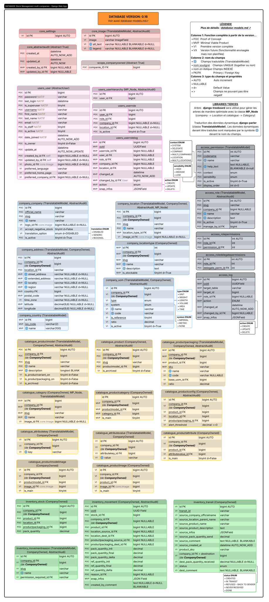
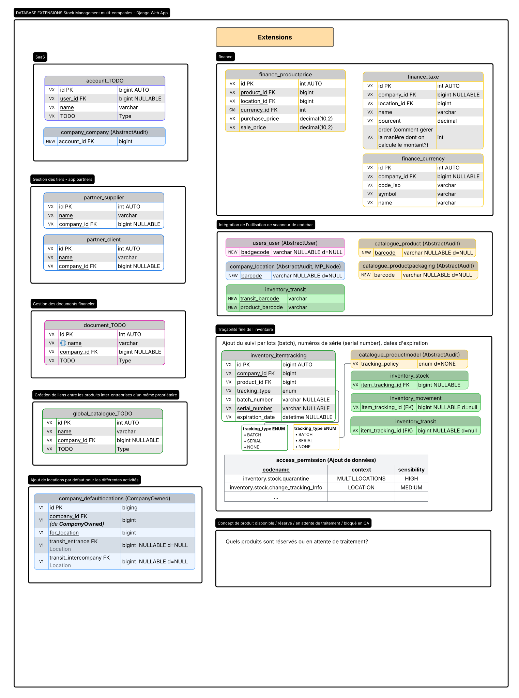

<div align="center">


# Base de données - django models

Projet Gestion de stocks — document de conception

  [](https://lucid.app/lucidchart/786327e6-745d-4881-95e1-39f3fdf33c66/view)

<h3>
<a href="#general">Généralités</a> | <a href="#core">Core</a> | <a href="#access">Access</a> | <a href="#scope">Scope</a> | <a href="#users">Users</a> | <a href="#company">Company</a> | <a href="#catalogue">Catalogue</a> | <a href="#inventory">Inventory</a> | <a href="#reporting">Reporting</a> | <a href="#others">Extensions</a>

</h3>

</div>

Ce document ajoute des commentaires explicatifs sur le schéma de la base de données (choix architecturale, notes de développement, etc.). Les modèles et composants ne sont pas listés de manière exhaustives dans le présent document (se référer au schéma dans LucidChart). 

[← Modules](5-django-apps-and-urls.md) | [Sommaire](2-conception.md) |  [Système d'inventaire →](7-inventory-system.md)

](schema_database.svg)
[Voir le Schéma de la base de données sur LucidChart](https://lucid.app/lucidchart/786327e6-745d-4881-95e1-39f3fdf33c66/view)

---

## Généralités <a id="general"></a>

### Limite des contraintes d'unicité contenant NULL

Une contrainte unique classique autorise plusieurs lignes contenant NULL, car MySQL ne considère pas deux NULL comme égaux pour cette contrainte.

Donc, si cette ligne existe :

```python
user_id=1, role_id=1, company_id=NULL, location_id=NULL, is_active=True
```

une autre ligne avec les mêmes valeurs pourra généralement être insérée, car `company_id `et `location_id `sont `NULL`.

Pour contrer cela, deux colonnes générées peuvent normaliser les valeurs `NULL` :

```sql
company_scope_key  = COALESCE(company_id, 0)
location_scope_key = COALESCE(location_id, 0)
```

Une contrainte unique est ensuite créée sur :

```text
user_id, role_id, company_scope_key, location_scope_key
```

Ainsi, une assignation globale est comparée comme suit :

```text
(user_id=1, role_id=1, company_scope_key=0, location_scope_key=0)
```

Une seconde assignation identique est donc refusée par la base de données.

Ces colonnes sont techniques : elles sont calculées automatiquement par MySQL et ne représentent pas de nouvelles données métier. Leur création est effectuée au moyen d’une migration Django personnalisée utilisant `migrations.RunSQL`.

---

##  Core <a id="core"></a>

Application qui rassemble le core de l'application web et les éléments partagés ([détails ⬀](5-django-apps-and-urls.md#core))

###  Settings (table `core_settings`)

Cette table centralise les configurations globales. 

*Note: incluait initialement un paramètre `currency` qui a été déplacé dans un futur module `finance`. La table `core_settings` est donc présentement vide.*

###  AbstractAudit (`abstract = True`)

Modèle abstrait pour encapsuler la gestion de champs d'audit aux différents modèles.

|  | Note                                                                                                                                                                                           |
|:------------------------------------------------------:| ---------------------------------------------------------------------------------------------------------------------------------------------------------------------------------------------- |
| `created_by_id`                                        | Utilisateur ayant créé l'information <br/>              |
| `updated_by_id`                                        | Dernier utilisateur ayant mis à jour l'information<br/>  |

##  Image (table `core_image`)

Modèle centralisé pour encadrer les images téléversées par les utilisateurs (photo des utilisateurs, images conceptuelles pour les catégories, images pour les produits) 

|  | Note                                                                                           |
|:------------------------------------------------------:| ---------------------------------------------------------------------------------------------- |
| `image`                                                | ImageField                                                                                     |
| `alt_text`                                             | Le texte alternatif à placer sur l'attribut "alt", pour l'accessibilité. Optionel, traduisible |
| `legend`                                               | Une courte description à afficher sous l'image. Optionel, traduisible.                         |

--- 

##  Access <a id="access"></a>

Application responsable du contrôle d'accès métier ([détails ⬀](5-django-apps-and-urls.md#access)).

###  Permission (table `access_permission`)

Catalogue des permissions métier disponibles dans l'application. Les données de cette table sont insérées à l'initialisation du système et ne changeront plus (à moins d'autres développements). Le référentiel des permissions (les données de cette table) est documenté dans [4-data-securiy.md#permissions](4-data-security.md#permissions).

Table immuable sans ADD, CHANGE ni DELETE. L'sjout  / suppression de permissions devraient se faire via des migrations personnalisées contrôlées. La seule modification autorisée est l'activation / désactivation temporaire dans le panneau d'administration de django.~~~~


|  | Note                                                                                                                                                                                                                                                                                                                              |
|:------------------------------------------------------:| --------------------------------------------------------------------------------------------------------------------------------------------------------------------------------------------------------------------------------------------------------------------------------------------------------------------------------- |
| `codename`                                             | Code unique de la permission métier                                                                                                                                                                                                                                                                                               |
| :globe_with_meridians:`name`                           | Nom lisible (traduisible)                                                                                                                                                                                                                                                                                                         |
| :globe_with_meridians:`help_text`                      | Explication longue, incluant parfois des exemples (traduisible).                                                                                                                                                                                                                                                                  |
| `context`                                              | Flag déterminant le contexte requis : SYSTEM, COMPANY, MULTI_COMPANIES, LOCATION ou MULTI_LOCATIONS                                                                                                                                                                                                                               |
| `sensibility`                                          | Flag déterminant le degré de sensibilité (HIGH, MEDIUM, LOW). Pourrait servir à mettre en place des avertissements de "Permission sensible" lors d'attribution de rôle.                                                                                                                                                           |
| `category`                                             | Flag déterminant la catégorie pour mieux gérer l'affichage des permissions : ACCESS, DELEGATE, USERS, COMPANY, CATALOGUE, INVENTORY, MOVEMENT, REPORTING. À noter que la catégorie DELEGATE a besoin que les permissions ainsi déléguéess soient renseignées (assignation de permission dans le modèle `RoleDelegatePermissions`) |
| `is_active`                                            | Permet de désactiver une permission sans la supprimer. Champs technique uniquement disponible dans l'admin django      .                                                                                                                                                                                                          |
| `display_order`                                        | Sert de premier tri pour une meilleure UX lors de la gestion des permissions et de leur assignation à des utilisateurs.                                                                                                                                                                                                           |

##  Role (table `access_role `)

Rôles métier. Un rôle regroupe plusieurs permissions.

Aucun rôle *Propriétaire* ne doit être créé car ce statut est géré par `User.is_owner`.


|  | Note                                                                                                                                                                                                                                                                                                                     |
|:------------------------------------------------------:| ------------------------------------------------------------------------------------------------------------------------------------------------------------------------------------------------------------------------------------------------------------------------------------------------------------------------ |
| `company_id`                                           | **NULL** : Permet de créer un rôle global (*ex: Gestionnaire*)<br/>**RENSEIGNÉ**: Permet de créer un rôle explicitement restreint à une entreprise (*ex: Gestionnaire Boutique ABC*).<br/>  |
| `is_active`                                            | Permet de désactiver un rôle. Toutes les demandes `has_perm()` en lien avec ce rôle renvoient alors `Faux`.                                                                                                                                                                                                              |

##  RolePermissions (table `access_rolepermissions `)

Association entre les rôles et les permissions octroyées par le rôle.


|  | Note                                                                                                                                                                        |
|:------------------------------------------------------:| --------------------------------------------------------------------------------------------------------------------------------------------------------------------------- |
| `role_id`                                              | Rôle<br/>                          |
| permission_id                                          | Permission associée au rôle<br/>  |

##  RoleDelegatePermissions (table `access_roledelegatepermissions `)

Association entre les rôles et les permissions déléguables, pour les permissions de catégorie DELEGATE. Cette liste ne donne pas le droit de réaliser l'action. Il s'agit de la liste de permissions que le rôle permet d'assigner à un autre utilisateur. Il y a actuellement deux permissions DELEGATE:  `access_role_manage `et `users_userrole_manage`.


|  | Note                                                                                                                                                                        |
| ------------------------------------------------------ | --------------------------------------------------------------------------------------------------------------------------------------------------------------------------- |
| `role_id`                                              | Rôle<br/>                          |
| delegate_perm_id                                       | Permission associée au rôle<br/>  |

## 

##  Log (table `access_log `)

Historique de toutes les modifications qui ont été réalisées dans les accès (en lecture seule). Permet un audit des Roles et de leurs permissions respectives (audit sur 2 tables à la fois).

 

|  | Note                                                                                                                                                                                  |
|:------------------------------------------------------:| ------------------------------------------------------------------------------------------------------------------------------------------------------------------------------------- |
| `target_table`                                         | `access_permission`ou `access_role`                                                                                                                                                   |
| target_id                                              | Fait référence à la PK de la `target_table`.<br/>Pas de on delete ICI (pas FK officielle car 2 tables)                                                                                |
| `role_id`                                              | Pour optimiser les requêtes de recherche. <br/>  |
| `changed_by_id`                                        | Utilisateur ayant réalisé la modification.<br/>  |
| `snap_infos`                                           | JSONField. Permet de faire un snapshot des informations au moment du changement.<br/>                                                                                                 |

**Exemples pour le champs `changes`**

* Création d'un nouveau rôle et assignations de 2 permissions à ce rôle (target_table='access_role', création d'un seul audit de log pour les 3 add en DB):

```json
{
  "action": "CREATE",
  "target_table": "access_role",
  "target_id": 4,
  "changed_by": { "id": 21, "username": "atremblay", "first_name": "Alice", "last_name": "Tremblay" },
  "old": null,
  "new": {
    "id": 4,
    "slug": "superviseur",
    "company_id": 1,
    "is_active": 1,
    "name": {
      "fr": "Superviseur",
      "en": "Supervisor"
    },
    "description": {
      "fr": "Rôle de gestion standard pour les boutiques.",
      "en": "Standard management role for stores."
    },
    "permissions": [
      {
        "id": 5,
        "codename": "users.user.add",
        "name": {
          "fr": "Ajouter un utilisateur",
          "en": "Add user"
        }
      },
      {
        "id": 8,
        "codename": "users.userrole.manage",
        "name": {
          "fr": "Gérer les rôles",
          "en": "Manage roles"
        }
      }
    ]
  }
}
```

* Modification du nom d'un rôle (target_table= 'access_role'):

```json
{
  "action": "UPDATE",
  "target_table": "access_role",
  "target_id": 4,
  "changed_by": { "id": 21, "username": "atremblay", "first_name": "Alice", "last_name": "Tremblay"},
  "old": {
    "id": 4, 
    "slug": "gestionnaire",
    "company_id": 1,
    "name": {
      "fr": "Gestionnaire",
      "en": "Manager"
    },
    "description": {
      "fr": "Rôle de gestion standard pour les boutiques.",
      "en": "Standard management role for stores."
    }
    "is_active": 1
  },
  "new": {
    "id": 4,
    "slug": "superviseur",
    "company_id": 1,
    "name": {
      "fr": "Superviseur",
      "en": "Supervisor"
    },
    "description": {
      "fr": "Rôle de supervision pour les succursales.",
      "en": "Supervisory role for branches."
    }
    "is_active": 1
  }
}
```

* Ajout d'une permission à un rôle (target_table = 'access_rolepermissions'):

```json
{
  "action": "CREATE",
  "target_table": "access_rolepermissions",
  "target_id": 89, 
  "changed_by": { "id": 21, "username": "atremblay", "first_name": "Alice", "last_name": "Tremblay" },
  "old": null,
  "new": {
    "role_permission": {
      "id": 89,
      "role_id": 4,
      "permission_id": 8
    },
    "role": {
      "id": 4,
      "slug": "superviseur",
      "company_id": 1,
      "name": {
        "fr": "Superviseur",
        "en": "Supervisor"
      }
    },
    "permission": {
      "id": 8,
      "codename": "users.userrole.manage",
      "context": "LOCATION",
      "sensitivity": "HIGH",
      "is_active": 1,
      "display_order": 12,
      "name": {
        "fr": "Gérer les rôles des utilisateurs",
        "en": "Manage user roles"
      },
      "help_text": {
        "fr": "Permet d'assigner ou de modifier les rôles.",
        "en": "Allows assigning or modifying roles."
      }
    }
  }
}
```

---

##  Scope <a id="scope"></a>

Application qui rassemble le contexte d'entreprise courant, le middleware et les managers filtrants [détails ⬀](5-django-apps-and-urls.md#scope).

###  CompanyOwned (`abstract = True`)

Classe abstraite qui encapsule l'appartenance à une compagnie. Elle centralise:

- la clé étrangère (FK) company

- l'utilisation de managers personnalisés

- une protection contre le changement de compagnie (`a.id = b.id` est interdit)

De plus, chaque modèle doit valider à l'enregistrement que l'élément créé ou mis à jour appartient bien à la même compagnie.

|  | Note                                 |
|:------------------------------------------------------:| ------------------------------------ |
| `company_id`                                           | Clé étrangère vers la compagnie mère |

---

##  Users <a id="users"></a>

Application responsable de l'identité utilisateur et de l'infrastructure d'authentification [détails ⬀](5-django-apps-and-urls.md#users). 

###  User (table `users_user`)

Entité centrale des utilisateurs étandant le modèle de base de Django (`AbstractUser`).


|  | Note                                                                                                                                                                                                                                                                                     |
|:------------------------------------------------------:| ---------------------------------------------------------------------------------------------------------------------------------------------------------------------------------------------------------------------------------------------------------------------------------------- |
| `is_superuser`                                         | Champs natif de django. Bypass sur toutes les permissions, autant sur le front-end que dans le panneau d'administration natif de django.                                                                                                                                                 |
| `is_staff`                                             | Champs natif de django. Permet d'accéder au panneau d'administration natif de django. Sera FAUX pour tous les utilisateurs finaux (inclut is_owner)                                                                                                                                      |
| `is_active`                                            | Champs natif de django. Bloque tous les accès à un utilisateur inactif, peu importe les rôles qui lui sont assignés.                                                                                                                                                                     |
| `is_owner`                                             | Propriétaire métier de toutes les compagnies du système. Bypass toutes les permissions dans le front-end.                                                                                                                                                                                |
| `created_by_id`                                        | Utilisateur ayant créé l'information.<br/> <br/>*Note: on n'utilise pas AbstractAudit ici pour éviter les références circulaires.*               |
| `updated_by_id`                                        | Dernier utilisateur ayant mis à jour l'information.<br/> <br/>*Note: on n'utilise pas AbstractAudit ici pour éviter les références circulaires.* |
| `photo_id`                                             | Image de profil. <br />                                                                                                                                   |
| `preferred_language`                                   | Option permettant de définir la langue d'affichage de l'interface et des données dynamiques.                                                                                                                                                                                             |
| `preferred_home_page`                                  | Option permettant de charger la page d'accueil le plus souvent utilisé par l'utilisateur (ex: propriétaire veut voir le dashboard global alors qu'un commis d'entrepôt utilisera principalement une vue simple pour scanner des produits)                                                |
| preferred_company                                      | Option permettant de sélectionner la compagnie active par défaut. Nécessaire si preferred_home_page est une page qui nécessite une compagnie active.                                                                                                                                     |

Règles liées à `is_owner` :

- plusieurs propriétaires peuvent exister ;
- seul un propriétaire peut créer un autre propriétaire ;
- un propriétaire peut être désactivé seulement s'il reste au moins un autre propriétaire actif ;
- un propriétaire peut être supprimé seulement s'il n'a aucun lien FK dans aucune table ;
- il doit toujours exister au moins un propriétaire actif ;
- le statut propriétaire est distinct de `is_superuser`.

Les employés sont des utilisateurs avec `is_owner=False`. Leurs accès sont gérés par les rôles et permissions de la table `users_userrole`.

###  UserHierarchy (table `users_userhierarchy`)

Table établissant une relation hiérarchique entre les utilisateurs grâce à `MP_Node `(django_treebeard). Avec les permissions appropriées, permet à un utilisateur de voir / modifier / gérer les permissions de tous ses subordonnés.

Un utilisateur peut avoir plusieurs superviseurs en faisant partie de différents arbres  hiérarchiques **distincts**. 

*À noter qu'un `User.is_owner = True` a tous les droits et n'a pas besoin de cet arbre pour voir tous les utilisateurs et leurs liens hiérarchiques.*

|  | Note                                                                                                                                 |
|:------------------------------------------------------:| ------------------------------------------------------------------------------------------------------------------------------------ |
| `user_id`                                              |   |

###  UserRole (table `users_userrole`)

Table de liaison entre les utilisateurs (`users_user`) et les rôles (`access_role`) . Remplace le modèle par défaut de Django pour l'attribution des permissions, qui n'avait aucun moyen d'isoler les données de chaque entreprise (company).


|  | Note                                                                                                                                                                                                                                                                                                                                                                                                                                                                                                                                                                               |
|:------------------------------------------------------:| ---------------------------------------------------------------------------------------------------------------------------------------------------------------------------------------------------------------------------------------------------------------------------------------------------------------------------------------------------------------------------------------------------------------------------------------------------------------------------------------------------------------------------------------------------------------------------------- |
| `user_id`                                              | Utilisateur concerné<br/>                                                                                                                                                                                                                                                                                                                                                                                                                             |
| `role_id`                                              | Rôle assigné<br/> <br/>                                                                                                                                                                                                                                                                                                                                                                                                                 |
| company_id                                             | Scope d'application du rôle. Voir la [matrice RBAC de data-security.md](4-data-security.md#matriceRBAC) pour les détails du comportement.<br/><br/>**Résumé**:<br/>* Si `NULL` et que le rôle est global (`access_role.company_id` est `NULL` aussi), l'utilisateur a accès à toutes les entreprises.<br/>*Si `NULL `et que le rôle n'est pas global ou que `NON NULL`, l'utilisateur est limité à l'entreprise défini par le rôle.*<br/><br/>  |
| `location_id`                                          | Permet de restreindre le champs d'accès à un emplacement paritculier. L'accès aux enfants de la `location_id `est permis si l'acces au parent est permis.<br/>                                                                                                                                                                                                                                                                                 |
| `is_active`                                            | Un rôle inactif est une permission désactivée. Permet de suspendre une assignation sans la supprimer.                                                                                                                                                                                                                                                                                                                                                                                                                                                                              |

###  UserRoleLog(table `users_userrolelog`)

Enregistre toutes modifications à la table `users_userrole`. 

 

|  | Note                                                                                                                                               |
|:------------------------------------------------------:| -------------------------------------------------------------------------------------------------------------------------------------------------- |
| `userrole_id`                                          |                       |
| `user_id`                                              |   |
| `role_id`                                              |             |
| `company_id`                                           |             |
| `location_id`                                          |             |
| `changed_by_id`                                        |   |
| snap_infos                                             | JSONField. Snapshot des informations avant et après le changement.                                                                                 |

**Exemple pour le champs `snap_infos`**

- Nouvelle assignation d'un rôle à un utilisateur (action = CREATE)

```json
{
  "action": "CREATE",
  "changed_by": {"id": 21, "username": "atremblay", "first_name": "Alice", "last_name": "Tremblay" },
  "old": null,
  "new": {
      "userrole_id": 4851,
      "user": {"id": 152, "username": "cguenette", "first_name": "Caroline", "last_name": "Guénette",
               "supervisors": [ {"id":21, "username": "atremblay", "first_name": "Alice", "last_name": "Tremblay" } ] }, 
      "role": {"id": 4, "slug": "gestionnaire", "name": "Gestionnaire", 
               "company": {"id": 1, "slug": "company-a", "official_name":"Company A"}, 
               "permissions": [
                    {"id": 5, "codename": "users.user.add", "is_active":1},
                    {"id": 8, "codename": "users.userrole.manage", "is_active":1}
                ] 
       }, 
       "company" : {"id": 1, "slug": "company-a", "official_name":"Company A"},
       "location" : {"id": 203, "slug": "boutique-a", "name":"Boutique A"},
       "is_active": true
   }
}
```

---

## <a id="company">  Company

Application permettant de configurer les entreprises, leur configuration et leurs emplacements [détails ⬀](5-django-apps-and-urls.md#company).

###  Company (table `company_company`)


Liste des entreprises et de leurs caractéristiques. Chaque compagnie est indépendante et isolée des autres. Les compagnies sont le pivot principal de séparation des données, même si elles appartiennent toutes au même propriétaire métier global. Ce rattachement permet :

- le filtrage des vues company-scoped ;
- la séparation des catalogues ;
- la séparation des stocks ;
- les permissions par compagnie ;
- les rapports par compagnie ;
- les rapports multi-compagnies (réservés au propriétaire et les utilisateurs avec les permissions appropriées).

|  | Note                                                                                                                                                                                                                                                                                                                                                                                                                                                                                                                                                                                                                                                  |
|:------------------------------------------------------:| ----------------------------------------------------------------------------------------------------------------------------------------------------------------------------------------------------------------------------------------------------------------------------------------------------------------------------------------------------------------------------------------------------------------------------------------------------------------------------------------------------------------------------------------------------------------------------------------------------------------------------------------------------- |
| `official_name`                                        | Nom officiel enregistré pour l'entreprise (non traduisible)                                                                                                                                                                                                                                                                                                                                                                                                                                                                                                                                                                                           |
| `slug`                                                 | Identifiant unique utilisé dans les URLs `/c/<company_slug>/...`                                                                                                                                                                                                                                                                                                                                                                                                                                                                                                                                                                                      |
| :globe_with_meridians: `name`                          | Nom commercial de l'entreprise (traduisible)                                                                                                                                                                                                                                                                                                                                                                                                                                                                                                                                                                                                          |
| `logo_id`                                              | Logo de l'entreprise<br/>                                                                                                                                                                                                                                                                                                                                                                                                                                                                                               |
| `is_multilingual_on`                                   |  Toujours `Disabled`. Les données dynamiques sont présentées dans la langue dans laquelle ils ont été écrits, peu importe la langue d'affichage de l'UI. L'UX apparaît comme une langue unique malgré leur gestion par la librairie tierce django-parler en arrière-plan.<br/> Permet d'activer la gestion multi-langages des données dynamiques. 2 options d'activation sont possibles: gestion des langues ou gestion des langues et des régionales. Cela permet une interface adaptée aux besoins de l'utilisateur (de simplifiée à complète) |
| `is_active`                                            |  Toujours `Vrai`<br/> Permet d'archiver une entreprise (`is_active=False`). Toutes ses caractéristiques, incluant son catalogue de produit et son inventaire, passe en mode lecture seule. La seule modification possible est la réactivation. Une entreprise archivée n'apparaît plus dans les rapports globaux mais ses rapports spécifiques sont toujours disponibles à la consultation. L'archivage est une action réservée exclusivement au propriétaire.                                                                                   |

###  Address (table `company_address`)

 TODO Unique: company_id, location_id

Adresse pour une location. Les locations de haut niveau (aucun parent) devrait avoir un enregistrement dans cette table.

|  | Note                                                                                                                                                                                                                                        |
|:------------------------------------------------------:| ------------------------------------------------------------------------------------------------------------------------------------------------------------------------------------------------------------------------------------------- |
| `company_id`<br/>(de **CompanyOwned**)                 |                                                                                                            |
| `location_id`                                          |                                                                                                           |
| :globe_with_meridians: `street_address`                | help_text=_("Street name, number, P.O. box")                                                                                                                                                                                                |
| :globe_with_meridians: `extended_address`              | help_text=_("Apartment, suite, unit, building, floor")                                                                                                                                                                                      |
| :globe_with_meridians: `locality`                      | help_text=_("City, town, or village")                                                                                                                                                                                                       |
| :globe_with_meridians: `region`                        | help_text=_("State, province, county, or canton")                                                                                                                                                                                           |
|                                                        | Adresse complète d'un emplacement de haut niveau (aucun parent)<br/>Choix fait de séparer l'adresse sur plusieurs choix pour faciliter la recherche/filtrage, uniformiser les données et permettre l'extension (ex: API tiers de livraison) |
| `time_zone`                                            |  Sert de référence pour les dates. À noter que les date sont toujours enregistrée au format UTC dans la base de données. Ce champs permet d'afficher l'heure locale.                      |
| `latitude`<br/> `longitude`                            | models.DecimalField(max_digits=9, decimal_places=6, blank=True, null=True)                                                                                                                                                                  |

###  Country (table `company_country`)

Liste des pays avec leur code iso, pour les adresses. Table statique, populée par le système.

###  Uom (table `company_uom`)

 (voir field `is_ref_contraint`)

Sigle pour "Unit of Measure". Permet de calculer les quantités selon différentes unités de mesure.

Chaque entreprise doit avoir **exactement une seule** référence (`is_reference=True`) par type de mesure utilisée (`WEIGHT`, `LENGTH`, `UNIT`, etc.).

- L'unité qui a `is_reference=True` doit **obligatoirement** avoir un `ratio = 1.0`

- Une unité qui a `is_reference=False` peut avoir n'importe quel ratio (y compris 1.0).

À la création d'une entrepise, cette table est populée à partir d'un gabarit (constante dans *src/core/utils/uom_template.py*) selon les préférences du propriétaire (*ex: Une entreprise de textile souhaite activer la vente par unité et par longueur, en système métrique seulement. Le système ajoutera donc les lignes du gabarit correspondant aux besoins indiqués*).

Uom implémente le modèle abstrait CompanyOwned.

|  | Note                                                                                                                                                                                                                                                                                                                                                     |
|:------------------------------------------------------:| -------------------------------------------------------------------------------------------------------------------------------------------------------------------------------------------------------------------------------------------------------------------------------------------------------------------------------------------------------- |
| `company_id`<br/>(de **CompanyOwned**)                 | Compagnie<br/>                                                                                                                                                                                                               |
| `type`                                                 | Catégorise l'unité (UNIT, WEIGHT, LENGTH, VOLUME, AREA ou TIME). Les conversions se font au sein d'un même type pour une entreprise donnée. <br/>NOTE: les ratios pour UNIT sont définis dans la table catalogue_productpackaging<br/>*Ex: une entreprise vendant des oeufs<br/>UNIT: Unité (1.0) [is_reference=True], Pièce (1.0) [is_reference=False]* |
| system                                                 | Indique le système de mesure utlisé par l'uom<br/>- UNIT et TIME: NONE<br/>- WEIGHT, LENGTH, VOLUME et AREA: IMPERIAL ou METRIC                                                                                                                                                                                                                          |
| `is_reference`                                         | Représente l'unité du groupe par type qui doit servir de référence pour le calcul des quantités totales en inventaire.                                                                                                                                                                                                                                   |
| is_ref_contraint                                       | Champs technique autocalculé uniquement créé car MySQL ne gère pas les contraintes unique avec condition. On profite du comportement où NULL != NULL. Ce champs contient NULL si is_reference est Faux et 1 si is_reference est Vrai. On peut ainsi créer un index valide avec la condition "1 seule valeur de référence par type".                      |
| `ratio`                                                | Facteur de conversion entre l'unité de référence et les autres définitions du même type d'unité.<br/>`Quantité en unité de référence = Quantité saisie * ratio de l'unité saisie.`                                                                                                                                                                       |
| `is_active`                                            | Permet de ne plus afficher l'unité de mesure (ex: dans les menus déroulants), sans la supprimer.                                                                                                                                                                                                                                                         |

###  Location (table `company_location`)

Définit la typologie des différents emplacements, de manière hiérarchique. Location implémente les modèles CompanyOwned (de scope), AbstractAudi (de code) et MP_Node (de django-treebeard).


 Création d'emplacement (location) de haut-niveau seulement (sans parent), 1 seul niveau de structure (pas d'enfants).

 Développement de l'UX pour créer une structure hiérarchique.

|  | Note                                                                                                                                                                                                                                                                                              |
|:------------------------------------------------------:| ------------------------------------------------------------------------------------------------------------------------------------------------------------------------------------------------------------------------------------------------------------------------------------------------- |
| `is_stockable`                                         | Détermine si la location peut contenir du stock d'inventaire. <br/><br/>**Règle métier:**<br/>- Si `is_stockable `est défini (`True `ou False`)`: Application directe de la valeur<br/>- Si `NULL`: si le noeud est une feuille, la location est stockable sinon la location n'est pas stockable. |
| `image_id`                                             |   Image optionnelle                                                                                                                                               |

*Exemple de structure*: 

- une entreprise peut être composée d'une boutique ABC à une certaine adresse postale et d'un entrepôt X à une autre adresse postale.
- l'entrepôt peut gérer finement les emplacements de son inventaire en créant des zones distintes organisées de manière hiérarchique alors que pour la boutique ABC, tout l'inventaire est simplement "dans la boutique", sans distinction.

*Concrètement*: 

* Boutique ABC (`type: boutique`)

* Entrepôt X (`type: entrepôt`)
  
  * Zone d'emballage (`type: zone-de-travail`)
  
  * Réception de marchandises (`type: zone-de-travail`)
  
  * Rangée A (`type: zone-de-circulation`)
    
    * Étagère A.1 (`type: zone-entreposage`)
    
    * Étagère A.2 (`type: zone-entreposage`)
  
  * Rangée B (`type: zone-de-circulation`)
    
    * Étagère B.1 (`type: zone-entreposage`)
    
    * ...
  
  * Frigo (`type: zone-entreposage`)
  
  * Lift 518 (`type: transit`)

###  LocationType (table `company_locationtype`)

Définit les types d'emplacements pour l'entreprise. Implémente CompanyOwned (de scope).


*Exemple*:

- Boutique

- Entrepôt

- Zone de travail

- Zone de circulation

- Entreprosage

- Transit (`description`: entreposage temporaire)

|  | Note                                                                                                                                     |
|:------------------------------------------------------:| ---------------------------------------------------------------------------------------------------------------------------------------- |
| `company_id` (de **CompanyOwned**)                     |   |
|                                                        |                                                                                                                                          |

---

##  Catalogue <a id="catalogue"></a>

Application gérant le référentiel des produits, leurs déclinaisons (variantes), leur classification (catégories), leurs images, leur conditionnement (packaging) et leurs caractéristiques techniques [détails ⬀](5-django-apps-and-urls.md#catalogue).

###  ProductFamily (table `catalogue_productfamily`)

Représente la "famille" de l'article. Implémente CompanyOwned (de scope) et AbstractAudit (de core).

|  | Note                                                                                                                                                                                                                                                                                                                                                                                                            |
|:------------------------------------------------------:| --------------------------------------------------------------------------------------------------------------------------------------------------------------------------------------------------------------------------------------------------------------------------------------------------------------------------------------------------------------------------------------------------------------- |
| `company_id` (de **CompanyOwned**)                     |                                                                                                                                                                                                                                                                          |
| `is_productvariant_on`                                 |  Toujours `Faux` Le système crée un modèle de produit et un variant unique, sans aucun attribut, de manière transparente pour l'utilisateur.<br/> Permet d'activer la gestion des produits par modèles et variants (ex: T-Shirt couleur bleue et grandeur Petit, T-Shirt couleur rouge et grandeur Moyen). |
| `is_productpackaging_on`                               |                                                                                                                                                                                                                                                                                                                                                                                                                 |
| `is_active`                                            |  Un modèle de produit archivé n'apparaît plus dans les recherches et rapports (le modèle et toutes ses variantes). Un produit peut être archivé seulement si son inventaire (toutes ses variantes) est nul.                                                                                                                                                   |

###  Product (table `catalogue_product`)

Repréente la déclinaison ou variante physique de l'article. Implémente CompanyOwned (de scope) et AbstractAudit (de core).

 

|  | Note                                                                                                                                                                                                                |
|:------------------------------------------------------:| ------------------------------------------------------------------------------------------------------------------------------------------------------------------------------------------------------------------- |
| `company_id` (de **CompanyOwned**)                     |                                                                                     |
| `product_family_id`                                    |                                                                                     |
| `is_active`                                            |  Un produit archivé n'apparaît plus dans les recherches et rapports (cette variante seulement). Un produit peut être archivé seulement si son inventaire est nul. |

###  ProductPackaging (table `catalogue_productpackaging`)

BADGE: DEV-POC-green Le conditionnement est toujours désactivé. Le système crée un conditonnement unitaire virtuel et pour l'utilisateur, le SKU semble être porté par le produit directement.

  Conditionne l'emballage des produits selon le types d'unité de mesure. Table de jointure entre les produits et les unités de mesure gérées par cette entreprise (`company_uom`).

Implémente CompanyOwned (de scope) et AbstractAudit (de core).

|  | Note                                                                                                                                                                                                                                                       |
|:------------------------------------------------------:| ---------------------------------------------------------------------------------------------------------------------------------------------------------------------------------------------------------------------------------------------------------- |
| `company_id` (de **CompanyOwned**)                     |                                                                                                                 |
| product_id                                             |                                                                                                                          |
| `name`                                                 | :globe_with_meridians: Nom commercial du conditionnement (`Ex: Douzaine, Caissette`) (traduisible)                                                                                                                                                         |
| `code`                                                 | :globe_with_meridians: Code ou abbréviation optionnel de l'emballage (traduisibile)                                                                                                                                                                        |
| `base_uom_id`                                          | Liaison vers l'unité de mesure de référence (`company_uom.isreference=True` et `company_uom.ratio=1.0`).<br/>  |
| `ratio`                                                | Coefficient multiplicateur par rapport à l'unité de référence.                                                                                                                                                                                             |

> **Note sur `base_uom_id`**
> Unité de mesure de référence (`company_uom.is_reference=True` et `company_uom.ratio=1.0`). Elle détermine la granularité mathématique minimale pour les calculs de conversion.

<br>

> **Règle de Calcul des Stocks Physiques**
> Lors d'un mouvement de stock utilisant un conditionnement, l'application `inventory` calcule la quantité absolue en base via la formule :
> `Quantité en unité de référence = Quantité de paquets * ratio`
> 
> *Exemple :* L'entrée en stock de **3** "Caissettes de 36 oeufs" (ratio 3.0 douzaines) incrémente l'inventaire de `3 * 3.0 = 9.0` douzaines.

<br>

**Contraintes d'Intégrité (Business Logic)**

- **Validation applicative :** Le champ `base_uom_id` doit obligatoirement pointer vers une ligne où `is_reference=True` au sein de la même entreprise.
- **Protection contre la suppression :** Un conditionnement ne peut pas être supprimé (`models.PROTECT`)  si des mouvements de stock historiques (`inventory_movement`) y font référence.

###  ProductConfig (table `catalogue_productconfig`)

Gère la configuration logistique locale des produits. Implémente CompanyOwned (de scope) et AbstractAudit (de core). 

Cette table associe un produit (`product_id`) à un emplacement physique (`location_id`) et un conditionnement afin de définir un **seuil d'alerte de stock bas** (`alert_threshold`). C'est cette table qui alimentera en arrière-plan les alertes du tableau de bord en comparant la configuration définie à l'inventaire en stock.

|  | Note                                                                                                                                       |
|:------------------------------------------------------:| ------------------------------------------------------------------------------------------------------------------------------------------ |
| `product_id`                                           |   |
| `location_id`                                          |    |
| `product_packaging_id`                                 |    |
| `alert_threshold`                                      | Seuil d'alerte bas                                                                                                                         |

### Category (table `catalogue_category`)

Structure l'arborescence du catalogue en catégories et sous-catégories de produits, facilitant la classification, la recherche et l'organisation logique. Implémente `CompanyOwned` (de scope) et `MP_Node `(de django-treebeard - pour la hiérarchisation en arbre).


|  | Note                                                                                                                                                                                                                                                                                                        |
|:------------------------------------------------------:| ----------------------------------------------------------------------------------------------------------------------------------------------------------------------------------------------------------------------------------------------------------------------------------------------------------- |
| `company_id` (de **CompanyOwned**)                     |                                                                                                                                                                           |
| `image_id`                                             |   <br /> Toujours NULL<br /> Associe une image à la catégorie |

###  ProductCategory (table `catalogue_productcategory`)

Table de jointure permettant d'associer un modèle de produit à une ou plusieurs catégories du catalogue. Implémente `CompanyOwned` (de scope).

|  | Note                                                                                                                                        |
|:------------------------------------------------------:| ------------------------------------------------------------------------------------------------------------------------------------------- |
| `product_family_id`                                    |      |
| `category_id`                                          |   |
| `is_main`                                              | Catégorie principale du produit.                                                                                                            |

###  AttributeKey (table `catalogue_attributekey`)

Permet de définir des atftributs dynamiques pour les variantes de produit. Implémente `CompanyOwned` (de scope).

|  | Note                                                                                                                                     |
|:------------------------------------------------------:| ---------------------------------------------------------------------------------------------------------------------------------------- |
| `company_id`                                           |   |

###  AttributeValue (table `catalogue_attributevalue`)

Permet de définir les valeurs d'un attribut pour les variantes de produit. Implémente `CompanyOwned` (de scope).

|  | Note                                                                                                                                       |
|:------------------------------------------------------:| ------------------------------------------------------------------------------------------------------------------------------------------ |
| `attributekey_id`                                      |   |

###  ProductAttribute (table `catalogue_productattributes`)

Associe un produit à une paire d'attribut key=value (relation Many-to-many). Implémente `CompanyOwned` (de scope).

|  | Note                                                                                                                                                      |
|:------------------------------------------------------:| --------------------------------------------------------------------------------------------------------------------------------------------------------- |
| product_id                                             |                         |
| attributevalue_id                                      |                         |
| `is_main`                                              |  Détermine si cette combinaison est la variante principale. Permet d'être affiché en premier dans l'UI. |

###  ProductFamilyImage (table `catalogue_productfamilyimage`)

Table de jointure entre la famille de produit et ses images (`core.image`). Implémente `CompanyOwned` (de scope).


|  | Note                                                                                                                                             |
|:------------------------------------------------------:| ------------------------------------------------------------------------------------------------------------------------------------------------ |
| `product_family_id`                                    |           |
| `image_id`                                             |   |

###  ProductImage (table `catalogue_productimage`)

Table de jointure entre un produit et ses images (`core.image`). Implémente `CompanyOwned` (de scope).


|  | Note                                                                                                                                     |
|:------------------------------------------------------:| ---------------------------------------------------------------------------------------------------------------------------------------- |
| `product_id`                                           |          |
| `image_id`                                             |   |

---

##  Inventory <a id="inventory"></a>

Application gérant l'état des stocks physiques, leur traçabilité et l'historique complet des mouvements de marchandises [détails ⬀](5-django-apps-and-urls.md#inventory).

###  Stock (table `inventory_stock`)

Représente l'état instantané du stock pour un produit donné. Les lignes ne sont jamais supprimées même pour un stock à 0 (pour préserver l'intégrité de stock_movement). Implémente `CompanyOwned` (de scope).

 

*Exemple: *

- *T-Shirt en coton, bleu, taille petit, Unité de type Unit, unité de 1, qté 6*

- *T-Shirt en coton, lbue, taille petit, Unité de type Unit, boîte de 20 unités, qté  5*

*La quantité totale en stock de ce produit dans cet emplacement est donc de 106 unités.*

|  | Note                                                                                                                                                |
|:------------------------------------------------------:|:--------------------------------------------------------------------------------------------------------------------------------------------------- |
| `company_id` (de **CompanyOwned**)                     |                       |
| `product_id`                                           |                       |
| `location_id`                                          |                       |
| `product_packaging_id`                                 |                       |
| `pack_quantity`                                        | Ce champs fait l'objet de permissions pointues pour pouvoir être modifiés et chaque modification est enregistrée dans la table`inventory_movement`. |

Dès que le champs `quantity` changent ou qu'une ligne est ajoutée dans `inventory_stock`, un mouvement d'inventaire est enregistré dans la table `inventory_movement`.

###  MovementReason (table `inventory_movementreason`)

Liste des raisons des mouvements d'inventaire pouvant être personnalisées. Implémente `CompanyOwned` (de scope).

Chaque raison est associée à un type de permission (liste des permissions possible: toutes les permissions commençant par `inventory.stock.` sauf `inventory.stock.view`). À la création d'une nouvelle entreprise, les raisons de base sont créées à partir d'un gabarit.  

Chaque raison produit un mouvement d'inventaire avec des caractéristiques particulière permettant de générer des rapports très précis (voir les exemples de chaque permission dans le [référentiel des permissions](4-data-security.md#permissions-reasons)). Ceci dit, un propriétaire pourrait choisir de ne pas utiliser ces raisons avec permissions granulaires et définir seulement des raisons avec les permissions INCREASE et DECREASE.


|  | Note                                                                                                                                                                                                                                                                                                                                                                                                                                                                                                                                                                                                                                                                                                                                                                                                                                                                            |
|:------------------------------------------------------:| ------------------------------------------------------------------------------------------------------------------------------------------------------------------------------------------------------------------------------------------------------------------------------------------------------------------------------------------------------------------------------------------------------------------------------------------------------------------------------------------------------------------------------------------------------------------------------------------------------------------------------------------------------------------------------------------------------------------------------------------------------------------------------------------------------------------------------------------------------------------------------- |
| `company_id` (de **CompanyOwned**)                     |                                                                                                                                                                                                                                                                                                                                                                                                                                                                                                                                                                                                                                                                                                                                        |
| `name`                                                 | Libellé de la raison (traduisible)                                                                                                                                                                                                                                                                                                                                                                                                                                                                                                                                                                                                                                                                                                                                                                                                                                              |
| `permission_required_id`                               | <br/> <br/><br/>Les permissions possibles sont: <br/>- Augmentation d'inventaire - raison générique (`INCREASE`)<br/> - Diminution d'inventaire - raison générique (`DECREASE`)<br/>- Achat (`PURCHASE`)<br/>- Manufacture (`MANUFACTURE`)<br/>- Vente (`SALE`)<br/>- Décompte d'inventaire - Ajout (`COUNT_MORE`)<br/>- Décompte d'inventaire - Retrait (`COUNT_LESS`)<br/>- Perte (`LOSS`)<br/>- Emballage (changement d'unité) (`PACK`)<br/>- Déballage (changement d'unité) (`UNPACK`)<br/>- Relocalisation interne (`RELOCATE`)<br/>- Sortie inter-adresse (`TRANSFER_OUT`)<br/>- Réception inter-adresse (`TRANFER_IN`)<br/>- Sortie inter-entreprise (`INTERCOMPANY_OUT`)<br/>- Réception inter-entreprise (`INTERCOMPANY_IN`) |

###  Movement (table `inventory_movement`)

Journal des mouvements d'inventaires. Chaque changement dans l'inventaire (création d'une entrée, modification d'une quantité dans `inventory_stock`) s'accompagne automatiquement de la création d'une entrée dans la table `inventory_movement`. À noter que la suppresion d'une entrée dans la table inventory_stock est bloquée.

Toutes les clés étrangères sont gérées exclusivement via l'ORM django sans représentation réelle dans la DB (pour des questions de performance) . 


|  | Note                                                                                                                                                                                                                                                                                                                                                                    |
|:------------------------------------------------------:| ----------------------------------------------------------------------------------------------------------------------------------------------------------------------------------------------------------------------------------------------------------------------------------------------------------------------------------------------------------------------- |
| `stock_id`                                             |                                                                                                                                                                                                                                        |
| `company_id` (de **CompanyOwned**)                     |                                                                                                                                                                                                                            |
| `product_id`                                           |                                                                                                                                                                                                                            |
| `location_source_id`                                   | Provenance du stock. Voir tableau ci-bas.<br/>                                                                                                                                                                                |
| `productpackaging_`<br/> `source_id`                   |                                                                                                                                                                                                                               |
| `quantity...`                                          | Enregistrement des valeurs initiale, finale et différentiellles des quantités, pour la quantité totale de ce produit (ref) et pour la quantité conditionnée (pack) en particulier. Permet d'optimiser recherche et filtre sans avoir à fouiller dans le champ `snap_infos`,  qui enregistre aussi ces informations.                                                     |
| `reason_id`                                            |                                                                                                                                                                                                                                       |
| `location_dest_id`                                     | Destination du stock. Voir tableau ci-bas.<br/>                                                                                                                                                                               |
| `snap_infos`                                           | JSONField. Snapshot permettant d'immortaliser les informations provenant des clés étrangères. La structure JSON copie les infos p ertinentes sur l'entreprise, le produit et les locations et renseigne les clés 'old' et 'new' pour les valeurs qui ont été modifiées. Le snpshot inclut le libellés de toutes les langues, les variantes enregistrées du modèle, etc. |
| `created_by_id`                                        |                                                                                                                                                                                                                                       |
| `created_by_comment`                                   | Commentaire facultatif enregistré par l'utilisateur à l'origine du mouvement d'inventaire.                                                                                                                                                                                                                                                                              |

Tableau résumé des informations enregistrées dans *location source* / *location destination* / *delta* selon les raisons du mouvement. 

- Les raisons `UOM_PACK `et `UOM_UNPACK `créent deux mouvements d'inventaire dont la résultante final de déplacement de stock est nul.

- Les raisons `TRANSFER_IN`, `TRANSFER_OUT`, `INTERCOMPANY_IN `et `INTERCOMPANY_OUT` créent également une entrée dans la table `inventory_transit`.

| No  | Raison Permission  | Location Source | Location Destination | Delta   | Note           |
| --- |:------------------ |:---------------:|:--------------------:|:-------:| -------------- |
| 1.  | `INCREASE`         | NULL            | NULL                 | ↑       |                |
| 2.  | `DECREASE`         | NULL            | NULL                 | ↓       |                |
| 3.  | `PURCHASE`         | NULL            | ✓                    | ↑       |                |
| 4.  | `MANUFACTURE`      | NULL            | ✓                    | ↑       |                |
| 5.  | `SALE`             | ✓               | NULL                 | ↓       |                |
| 6.  | `COUNT_MORE`       | ✓               | ✓                    | ↑       |                |
| 7.  | `COUNT_LESS`       | ✓               | ✓                    | ↓       |                |
| 8.  | `LOSS`             | ✓               | NULL                 | ↓       |                |
| 9.  | `UOM_PACK`         | ✓<br/>NULL      | NULL<br/>✓           | ↓<br/>↑ | Delta final: 0 |
| 10. | `UOM_UNPACK`       | NULL<br/>✓      | ✓<br/>NULL           | ↑<br/>↓ | Delta final: 0 |
| 11. | `RELOCATE`         | ✓               | ✓                    | 0       |                |
| 12. | `TRANSFER_OUT`     | ✓               | NULL                 | ↓       | +Transit       |
| 13. | `TRANFERT_IN`      | NULL            | ✓                    | ↑       | +Transit       |
| 14. | `INTERCOMPANY_OUT` | ✓               | NULL                 | ↓       | +Transit       |
| 15. | `INTERCOMPANY_IN`  | NULL            | ✓                    | ↑       | +Transit       |

###  Transit (table `inventory_transit`)

Cette table gère l'état temporaire des marchandises qui ont quitté leur emplacement d'origine mais n'ont pas encore été réceptionnées à leur destination finale. Elle permet un suivi interne du stock en cours de déplacement **POUR LA COMPAGNIE DESTINAIRE**.

Une entrée de transit est créée pour les mouvements d'inventaire suivants :

* `TRANSFER_OUT` et `TRANFERT_IN` : Transfert inter-emplacements de haut niveau
  
  * *Ex: Transfert entre l'Entrepôt X et la Boutique ABC* , appartenant tous les deux à la même entreprise.

* `INTERCOMPANY_OUT` et `INTERCOMPANY_IN`: Transfert inter-entreprises entre entreprises appartenant à un même propriétaire.
  
  * *Ex: Transfert entre Entrepôt X Inc. et Les boutiques ABC Inc., appartenant tous les deux au même propriétaire.*

|  | Note                                                                                                                                                                                      |
|:------------------------------------------------------:| ----------------------------------------------------------------------------------------------------------------------------------------------------------------------------------------- |
| `uuid`                                                 | Identification du colis                                                                                                                                                                   |
| `source_company_officialname`                          | Nom de la compagnie qui envoie le colis (snapshot à l'intention du destinataire)                                                                                                          |
| `source_location_parent_name`                          | Origine du colis. Il s'agit de la location du plus haut niveau: cette location n'a pas de parent (snapshot à l'intention du destinataire)                                                 |
| `source_product_name`                                  | Nom du produit (snapshot à l'intention du destinataire)                                                                                                                                   |
| `source_infos`                                         | JSONField (snapshot d'infos complémentaires à l'intention du destinataire)                                                                                                                |
| `source_pack_quantity_send`                            | Quantité envoyée. Il s'agit de la quantité conditionnée.                                                                                                                                  |
| `source_comment`                                       | Commentaire optionnel entrée par l'expéditeur.                                                                                                                                            |
| `source_created_at`                                    | Date et heure de la création de l'entrée. Champs automatique à la création, en consultation seulement.                                                                                    |
| `product_sku`                                          | Identification du produit envoyé. Indispensable pour les transferts inter-entreprises car les référents de produits ne sont pas les mêmes.                                                |
| `company_id` (de **CompanyOwned**)                     | Il s'agit de la compagnie de destination.<br/>  |
| `dest_pack_quantity_received`                          | Quantité reçue                                                                                                                                                                            |
| `status`                                               | enum                                                                                                                                                                                      |
| `dest_comment`                                         | Commentaire optionnel entré par le destinataire.                                                                                                                                          |

---

## <a id="reporting"> Reporting

Application regroupant les rapports par entreprises et les rapports globaux [détails ⬀](5-django-apps-and-urls.md#reporting).

> [!WARNING]
> <mark>TODO</mark>: Toute la logique sur l'aspect des rapports et graphiques doit faire l'objet d'une réflexion plus poussée.

---

## <a id="others"> Extensions - Autres fonctionnalités permettant d'étendre le système de Gestion de stocks

Plusieurs autres points et fonctionnalités ont fait l'objet d'une réflexion. Ces éléments ajouteraient d'autres modèles et/ou modifieraient les modèles existant. Certains détails peuvent être retrouvés sur le schéma LucidChart de la base de données dans une section dédiée aux extensions.

* Évolution vers un vrai système multi-tenants
  
  * Ajout d'une app `account` entre le propriétaire et les entreprises
  * Nécessite une révison du système d'accès et de la logique concernant user.is_owner.

* Gestion des tiers (fournisseurs et clients):
  
  * Application `partners `avec modèles `Supplier `et `Customer`

* Intégration de scan pour les barcode (interface adaptée)

* Liaison avec des documents justificatifs:
  
  * Ajout d'un champ `reference_document` ou d'une table dédiée aux commandes/factures permettant de lier le mouvement à sa source légale ou commerciale.

* Traçabilité fine de l'inventaire (lots, numéros de série, date de péremption / expiration)
  
  * batch_number
  * serial_number, 
  * expiration_date

* Ajouter la notion de Link entre produits (produits similaires)
  
  * Links entre produit d'une même compagnie (ok, pas de risque de fuite de données)
  * Links entre produits de compagnie différentes (implique permissions très élevées genre super-user pour modifier les liens et éviter fuite de données)
  * Apps GlobalCatalogue, réservé aux admin

* Gestion financière
  
  * Prix de gros, de vente, ect
  * Devises selon les locations
  * Dashboard avec des graphiques sur les états financiers

](schema_database_extended.svg)
