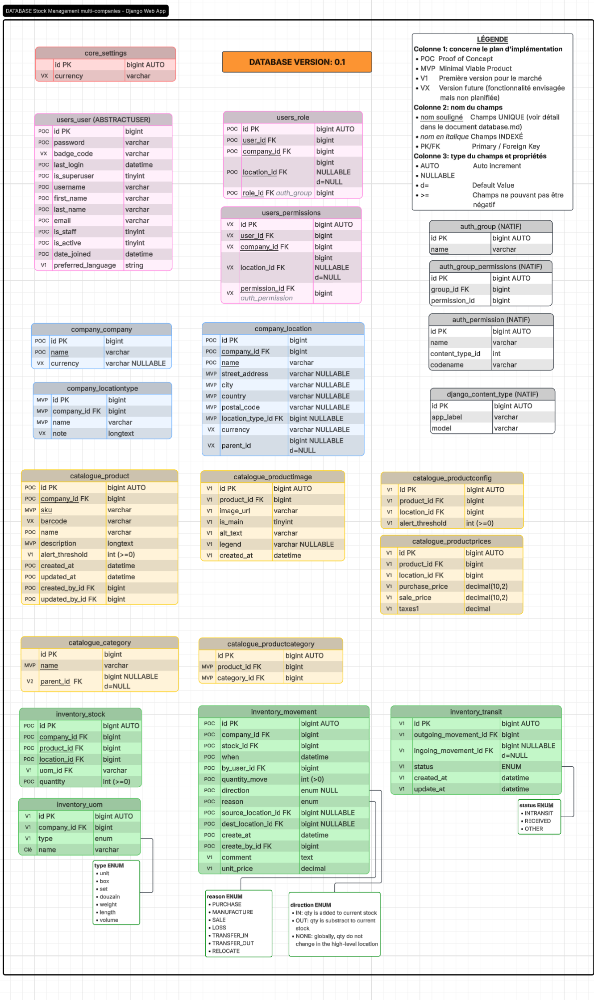

# Database (modèles et apps django)

Projet Gestion de stocks — document de travail

  

<h3>

<a href="#auth">Auth</a> (Natif Django) |
<a href="#core">Core</a> |
<a href="#users">Users</a> |
<a href="#company">Company</a> |
<a href="#catalogue">Catalogue</a> |
<a href="#inventory">Inventory</a> |
<a href="#reporting">Reporting</a> |
<a href="#others">Autres...</a>

</h3>

Ce document ajoute des commentaires explicatifs sur le schéma de la base de données (choix technique, notes de développement, etc.). Les apps django, modèles, table ou noms des champs ne sont pas listés de manière exhaustives dans le présent document (se référer au schéma).

[Voir le Schéma de la base de données sur LucidChart](https://lucid.app/lucidchart/786327e6-745d-4881-95e1-39f3fdf33c66/edit?viewport_loc=4219%2C-3440%2C2860%2C1419%2C0_0&invitationId=inv_16c572fc-aaf2-4b0e-9e8f-636d2cf04698) - compte gratuit LucidChart requis.

---

## <a id="auth">  Auth

Application native du système d'authentification de Django qui stocke les groupes d'utilisateurs et les permissions pour gérer les autorisations.

###  Group (table `auth_group`)

Cette table stocke les groupes de permissions pour gérer les autorisations en lot.

Pour contourner la limitation de django qui n'a pas de système du type "AbstractGroup" qui permettrait d'ajouter un champs company_id, le champs `name `sera préfixé par "company_id_" (*Exemple: 1_Gestionnaire*). Cette gestion sera totalement transparente pour l'utilisateur final. Voir [docs/database.md](./docs/database.md#isolation_rôles) pour plus de détails.

---

## <a id="core">  Core

Application qui rassemble le core de l'application web.

###  Settings (table `core_settings`)

Cette table centralise les configurations globales .

|  | Note                                                                                                                                                                                                                                                            |
| ------------------------------------------------------ | --------------------------------------------------------------------------------------------------------------------------------------------------------------------------------------------------------------------------------------------------------------- |
| badge_code                                             |  Permet de se connecter en scannant un code bar sur un badge d'identification                                                                                                                                |
| currency                                               |  Sert de référence monétaire globale pour l'ensemble de l'application et donc toutes les compagnies et leurs locations. Est écrasé par Company.currency et Location.currency s'ils sont définis  |

## <a id="users">  Users

Gère les utilisateurs et leur permission. [Voir le document data-security.md](data-security.md) pour plus de détails sur la mise en oeuvre des accès et les choix technique réalisés à ce niveau.

###  User (table `users_user`)

Entité centrale des utilisateurs étandant le modèle de base de Django (`AbstractUser`).

###  Role (table `users_role`)

Table de liaison tripartite entre `users_user `et `auth_group`. Elle sert à assigner un ou plusieurs rôles à un utilisateur donné. Remplace le modèle par défaut de Django pour l'attribution des permissions, qui n'avait aucun moyen d'isoler les données de chaque entreprise (company). Une quatrième clé optionnelle (location_id) permet d'affiner encore plus le niveau d'accès.

|  | Note                                                                                                    |
| ------------------------------------------------------ | ------------------------------------------------------------------------------------------------------- |
| location_id                                            | Si NULL, le rôle s'applique à TOUTE la compagnie. Sinon, uniquement à ce lieu et ses sous-locations. |

###  Permissions (table `users_permissions`)

Table de liaison tripartite entre `users_user `et `auth_permission`. Elle sert à assigner directement une permission à un utilisateur, sans passer par les rôles, tout en respectant le principe d'isolation des compagnies.

|  | Note                                                                                                    |
| ------------------------------------------------------ | ------------------------------------------------------------------------------------------------------- |
| location_id                                            | Si NULL, le rôle s'applique à TOUTE la compagnie. Sinon, uniquement à ce lieu et ses sous-locations. |

---

# <a id="company">  Company

Gère les entreprises et leurs locations. Il s'agit du pivot central du multi-tenant permettant de cloisonner hermétiquement le catalogue et les stocks de chaque organisation.

###  Company (table `company_company`)

Liste des entreprises gérées. Chaque compagnie est indépendante et isolée des autres. Seul les super-user peuvent voir les informations globales de toutes les compagnies.

|  | Note                                                                                                                                                                                                                             |
| ------------------------------------------------------ | -------------------------------------------------------------------------------------------------------------------------------------------------------------------------------------------------------------------------------- |
| currency                                               |  Sert de référence monétaire pour cette compagnie.  Écrase le paramètre global de Settings et peut être écrasé par le paramètre défini dans Location.currency |

###  Location (table `company_location`)

Table modélisant la hiérarchie complète de l'entreprise.

*Exemples:*

- une entreprise peut être composée d'une boutique A à l'adresse x et d'un entrepôt B à l'adresse y.
- la boutique A peut localiser son stock en créant une Zone emballage, Zone Frigo, Étagère A1, etc.

|  | Note                                                                                                                                                                                                             |
| :----------------------------------------------------- | ---------------------------------------------------------------------------------------------------------------------------------------------------------------------------------------------------------------- |
| strret_address city country postal_code | Choix fait de séparer l'adresse sur plusieurs choix pour faciliter la recherche/filtrage, uniformiser les données et permettre l'extension (ex: API tiers de livraison)                                        |
| currency                                               |  Sert de référence monétaire pour cette location.  Écrase les paramètres plus globaux (Settings, Company)                                         |
| parent_id                                              |  Toujours NULL  Permet d'affiner l'emplacement du stock dans la location en créant des sous-locations |

###  LocationType (table `company_locationtype`)

Définit la typologie des différents emplacements enregistrés dans le système (par exemple : Boutique, Entrepôt, Zone de transit, Palette, etc). Configurables par entreprise dans le panneau de contrôle.

---

# <a id="catalogue"> Catalogue

###  Product (table `catalogue_product`)

Fiche descriptive d'un produit. Centralise les données globales d'identification du produit (comme le code SKU, le code-barre et le nom) ainsi que des champs d'audit. Chaque entreprise a son catalogue de produits.

|  | Note                                                                                                                                                                                                                                  |
| ------------------------------------------------------ | ------------------------------------------------------------------------------------------------------------------------------------------------------------------------------------------------------------------------------------- |
| barcode                                                |  Fonctionnalité de scan par code barre                                                                                                                                            |
| alert_threshold                                        |  Permet de définir un seuil d'alerte global pour ce produit.  Écrasé  par la configuration par location si elle existe |

###  ProductImage (table `catalogue_productimage`)

Associe une ou plusieurs images à un Produit, incluant la gestion d'une image principale (`is_main`) et des textes alternatifs pour l'accessibilité.

###  ProductConfig (table `catalogue_productconfig`)

Table permettant d'affiner la configuration d'un produit par location. Si une entrée existe pour le produit et la location, elle écrasera les champs équivalents de Produit.

###  ProductPrices (table `catalogue_productprices`)

Regroupe les informations financières d'un produit, par location.

> [!WARNING]
> TODO: Toute la logique sur l'aspect financier doit faire l'objet d'une réflexion plus poussée.

###  Category (table `catalogue_category`)

Structure l'arborescence du catalogue en catégories et sous-catégories de produits, facilitant la classification, la recherche et l'organisation logique des stocks.

|  | Note                                                                                                                                                                                               |
| :----------------------------------------------------- | -------------------------------------------------------------------------------------------------------------------------------------------------------------------------------------------------- |
| parent_id                                              |  Toujours NULL  Implémentation de la fonctionnalité pour hiérachiser les catégories |

###  Category (table `catalogue_productcategory`)

Table de jointure permettant d'associer un produit à une ou plusieurs catégories du catalogue.

---

# <a id="inventory">  Inventory

###  Stock (table `inventory_stock`)

Représente l'état instantané du stock disponible pour un produit donné à un instant T, strictement isolé et rattaché à une entreprise spécifique.

|  | Note                                                                                                                                                                                                                                                                                                                                            |
| ------------------------------------------------------ | :---------------------------------------------------------------------------------------------------------------------------------------------------------------------------------------------------------------------------------------------------------------------------------------------------------------------------------------------- |
| company_id                                             | Champs en provenance de Product et de Location (qui doivent être = d'ailleurs). Permet de filtrer plus facilement et appliquer la règle d'unicité combinée. Permet aussi de surcharger la méthode `clear()` pour intercepter écriture en DB d'un Produit qu'on tenterait d'assigner à une location qui n'est pas dans sa compagnie. |
| quantity                                               | Ce champs fait l'objet de permissions pointues pour pouvoir être modifiés et chaque modification est enregistrée dans la table`inventory_movement`.                                                                                                                                                                                          |

Dès que les champs `location_id `ou `quantity `changent ou qu'un ligne est ajouté ou supprimé dans `inventory_stock`, un mouvement d'inventaire est enregistré dans la table `inventory_movement`. La classe Stock enregistre des permissions granulaires pour ces actions.

Liste des permissions de mouvement de stocks :

* `PURCHASE` : Approvisionnement / Achat de marchandise
* `MANUFACTURE` : Production interne
* `SALE` : Sortie pour vente
* `LOSS` : Perte, casse ou vol constaté
* `TRANSFER_IN` : Entrée via un transfert inter-location au sein d'une même compagnie
* `TRANSFER_OUT` : Sortie via un transfert inter-location au sein d'une même compagnie
* `INTERN_PURCHASE`: Entrée via un transfert inter-entreprise
* `INTERN_SALE`: Sortie via un transfert inter-entreprise
* `RELOCATE` : Changement d'emplacement au sein de la même location de haut niveau (parent = NULL)

**Direction du mouvement (`movement_direction` ENUM) :**

* `IN` : La quantité est ajoutée au stock courant.
* `OUT` : La quantité est soustraite du stock courant.
* `NONE` : Le niveau global de stock ne change pas (lié à `mouvement.relocate`).

Sécurité

###  Uom(table `inventory_uom`)

Sigle pour "Unit of Measure". Fonctionnalité ajoutée dans la  . Avant son intégration, la quantité est toujours considéré comme étant unitaire.

###  Movement (table `inventory_movement`)

Journal d'historique des mouvements d'inventaires.

|  | Note                                                                                                                                                         |
| ------------------------------------------------------ | ------------------------------------------------------------------------------------------------------------------------------------------------------------ |
| source_location_id                                     | Pour les mouvements internes (inter-location ou inter-company), renseigne la provenance de haut-niveau (`company_location.parent_id = null`) du mouvement   |
| dest_location_id                                       | Pour les mouvements internes (inter-location ou inter-company), renseigne la destination de haut-niveau (`company_location.parent_id = null`) du mouvement |
| unit_price                                             | Permet d'immortaliser la valeur financière du produit au moment du mouvement                                                                                |

---

# <a id="reporting"> Reporting

> [!WARNING]
> TODO: Toute la logique sur l'aspect des rapports et graphiques doit faire l'objet d'une réflexion plus poussée en lien avec les besoins DB

# <a id="others"> Autres fonctionnalités

* Traduction de l'aspect Data
  * `django-parler`?
* Gestion des tiers (fournisseurs et clients):
  * Application `partners `avec modèles Supplier et Customer, lié au modèle `company.Company`
  * Pour le modèle Movement: héritage de modèle ou table d'extension en relation OneToOne.
* Liaison avec des documents justificatifs:
  * Ajout d'un champ `reference_document` ou d'une table dédiée aux commandes/factures permettant de lier le mouvement à sa source légale ou commerciale.
* Traçabilité fine de l'inventaire (lots, numéros de série, date de péremption / expiration) : champs optionnels (null=True, blanc=True)
  * batch_number, serial_number, expiration_date...
* Gestion de déclinaisons de produits (couleur, taille, etc)
* Ajouter la notion de Link entre produits (produits similaires, produits identiques)
  * Links entre produit d'une même compagnie (ok, pas de risque de fuite de données)
  * Links entre produits de compagnie différentes (implique permissions très élevées genre super-user pour modifier les liens et éviter fuite de données)
  * Solution: tous liens--> Apps GlobalCatalogue, réservé aux admin
* Gestion financière
  * Prix de gros, de vente, ect
  * Devises selon les locations
  * Dashboard avec des graphiques sur les états financiers
