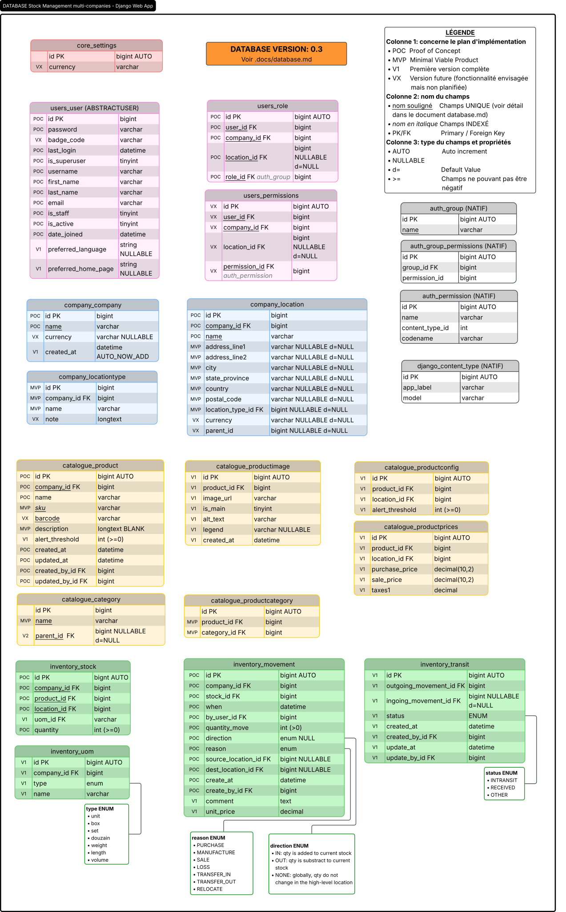

<div align="center">


# Django Models (database only)

Projet Gestion de stocks — document de travail

  [](https://lucid.app/lucidchart/786327e6-745d-4881-95e1-39f3fdf33c66/view)

<h3>

<a href="#access">Access</a> | <a href="#core">Core</a> | <a href="#users">Users</a> | <a href="#company">Company</a> | <a href="#catalogue">Catalogue</a> | <a href="#inventory">Inventory</a> | <a href="#reporting">Reporting</a> | <a href="#others">Autres...</a>

</h3>

</div>

Ce document ajoute des commentaires explicatifs sur le schéma de la base de données (choix architecturale, notes de développement, etc.). Les apps django, modèles, table ou noms des champs ne sont pas listés de manière exhaustives dans le présent document (se référer au schéma dans LucidChart).

[](django_stock.svg
[Voir le Schéma de la base de données sur LucidChart](https://lucid.app/lucidchart/786327e6-745d-4881-95e1-39f3fdf33c66/view)

---

## <a id="access">  Access

Application responsable du contrôle d'accès métier. Elle implémente un RBAC custom utilisé pour limiter les droits des employés par compagnie, par location et par permission.

L'application n'utilise pas les permissions natives `auth_permission` de Django pour les droits métier. Django Auth est conservé pour l'identité, l'authentification, les sessions et l'administration technique.

Le statut propriétaire n'est pas représenté par un rôle RBAC. Il est porté directement par le champ `users.User.is_owner`.

###  Permission (table `access_permission`)

Catalogue des permissions métier disponibles dans l'application. Les données de cette table sont insérées à l'initialisation du système et ne changeront plus (à moins d'autres développements...). Le référentiel des permissions (les données de cette table) est documenté dans [data-securiy.md](data-securiy.md#permissions).


|  | Note                                                                                                                                                                       |
|:------------------------------------------------------:| -------------------------------------------------------------------------------------------------------------------------------------------------------------------------- |
| `codename`                                             | Code unique de la permission métier. Un code name respecte toujours la convention de nommage suivante: `app_name`.`model_name`.`permission_name`                           |
| `name`                                                 | Nom lisible                                                                                                                                                                |
| `need_companycontext`<br/>`need_globalcontext`         | Type de contexte requis pour la permission                                                                                                                                 |
| `is_movementreason`                                    | Flag déterminant si c'est une permission granulaire pour la gestion des quantités en inventaire.                                                                           |
| `is_owner_perm`                                        | Flag déterminant si cette permission est habituellement réservée uniquement au propriétaire. Pourrait servir à mettre en place des avertissements de "Permission sensible" |
| `is_active`                                            | Permet de désactiver une permission sans la supprimer. Accessible uniquement dans l'admin django.                                                                          |
| `display_order`                                        | Sert de premier tri pour une meilleure UX lors de la gestion des permissions.                                                                                              |

##  Role (table `access_role `)

Rôle métier assignable aux employés. Un rôle regroupe plusieurs permissions.

Aucun rôle `Owner` ne doit être créé car le statut propriétaire est géré par `users.User.is_owner`.


|  | Note                                                                                                                                                                                 |
|:------------------------------------------------------:| ------------------------------------------------------------------------------------------------------------------------------------------------------------------------------------ |
| `company_id`                                           | **NULL** : Permet de créer un rôle global (*ex: Gestionnaire*)<br/>**RENSEIGNÉ**: Permet de créer un rôle explicitement restreint à une entreprise (*ex: Gestionnaire Boutique ABC*) |
| `is_active`                                            | Permet de désactiver un rôle                                                                                                                                                         |

##  RolePermission (table `access_rolepermissions `)

Association entre les rôles et les permissions (Many-to-many).


##  Log (table `access_log `)

Historique de toutes les modifications qui ont été réalisées dans les accès (en lecture seule). Permet un audit des Roles et de leurs permissions respectives (audit sur 2 tables à la fois).

|  | Note                                                                                                                                                                          |
|:------------------------------------------------------:| ----------------------------------------------------------------------------------------------------------------------------------------------------------------------------- |
| `target_table`                                         | `access_permission `ou `access_role`                                                                                                                                          |
| target_id                                              | Fait référence à la PK de la `target_table`                                                                                                                                   |
| `role_id `FK                                           | Pour optimiser les requêtes de recherche. L'information se répète dans le champ changes mais en faire une FK explicite permet d'optimiser les requêtes de recherche.          |
| `snap_infos`                                           | JSONField. Permet de faire un snapshot des informations au moment du changement:<br/>Inclus: logged user infos, infos sur target (les libellés), info qui a changé: old, new. |

**Exemples pour le champs `changes`**

* Modification du nom d'un rôle (target_table= 'role'):

```json
{ "name": {"old": "Gestionnaire", "new": "Super Gestionnaire"}}
```

* Ajout d'une permission à un rôle (target_table = 'role_permission'):

```json
  {

     "permission_id": { "old": null, "new": 14 }

     "permission_codename": { "old": null, "new": 14 } 

  }
```

---

## <a id="core">  Core

Application qui rassemble le core de l'application web et les éléments partagés.

###  Settings (table `core_settings`)

Cette table centralise les configurations globales. Pas utilisé  ni implémenté pour le moment.

###  AbstractAudit (table `core_abstractaudit`)

Modèle abstrait pour faciliter l'ajout de champs d'audit aux modèles de données sensibles.

##  Image (table `core_image`)

Modèle centralisé pour encadrer les images téléversées par les utilisateurs (photo des utilisateurs, images conceptuelles pour les catégories, images pour les produits) 

--- 

## <a id="users">  Users

Application responsable de l'identité utilisateur et de l'infrastructure d'authentification. 

Elle s'appuie sur Django Auth pour :

- l'authentification ;
- les sessions ;
- les mots de passe ;
- les champs standards comme `is_active`, `is_staff` et `is_superuser`.

Les permissions métier ne sont pas gérées par les tables natives `auth_group` ou `auth_permission`. Elles sont gérées dans l'application `access`. [Voir le document data-security.md](data-security.md) pour plus de détails sur la mise en oeuvre des accès et les choix techniques réalisés à ce niveau.

###  User (table `users_user`)

Entité centrale des utilisateurs étandant le modèle de base de Django (`AbstractUser`).


|  | Note                                                                                                                                                                                                                                      |
|:------------------------------------------------------:| ----------------------------------------------------------------------------------------------------------------------------------------------------------------------------------------------------------------------------------------- |
| `is_superuser`                                         | Champs natif de django. Bypass sur toutes les permissions, autant sur le front-end que dans le panneau d'administration natif de django.                                                                                                  |
| `is_staff`                                             | Champs natif de django. Permet d'accéder au panneau d'administration natif de django. Sera FAUX pour tous les utilisateurs finaux (inclut is_owner)                                                                                       |
| `is_active`                                            | Champs natif de django. Bloque tous les accès à un utilisateur inactif, peu importe les rôles qui lui sont assignés.                                                                                                                      |
| `is_owner`                                             | Propriétaire métier de toutes les compagnies du système. Bypass toutes les permissions dans le front-end.                                                                                                                                 |
| `badge_code`                                           |  Permet de se connecter en scannant un codebar sur un badge d'identification                                                                                                            |
| `preferred_language`                                   | Option permettant de définir la langue d'affichage de l'interface et des données dynamiques.                                                                                                                                              |
| `preferred_home_page`                                  | Option permettant de charger la page d'accueil el plus souvent utilisé par l'utilisateur (ex: propriétaire veut voir le dashboard global alors qu'un commis d'entrepôt utilisera principalement une vue simple pour scanner des produits) |

Règles liées à `is_owner` :

- plusieurs propriétaires peuvent exister ;
- seul un propriétaire peut créer un autre propriétaire ;
- un propriétaire peut être désactivé seulement s'il reste au moins un autre propriétaire actif ;
- un propriétaire peut être supprimé seulement s'il n'a aucun lien FK dans aucune table ;
- il doit toujours exister au moins un propriétaire actif ;
- le statut propriétaire est distinct de `is_superuser`.

Les employés sont des utilisateurs avec `is_owner=False`. Leurs accès sont gérés par les rôles et permissions de la table `users_userrole`.

###  UserRole (table `users_userrole`)

Table de liaison entre les utilisateurs (`users_user`) et les rôles (`access_roles`) . Remplace le modèle par défaut de Django pour l'attribution des permissions, qui n'avait aucun moyen d'isoler les données de chaque entreprise (company).


|  | Note                                                                                                                                                                                                                                                                                                                                                                                                                                                                                                                                         |
|:------------------------------------------------------:| -------------------------------------------------------------------------------------------------------------------------------------------------------------------------------------------------------------------------------------------------------------------------------------------------------------------------------------------------------------------------------------------------------------------------------------------------------------------------------------------------------------------------------------------- |
| company_id                                             | * Si `NULL` et que le rôle est global (`access_role.company_id` est `NULL` aussi), l'utilisateur a accès à toutes les entreprises.<br/>* Si `NULL `et que le rôle n'est pas global ou que `NON NULL`, l'utilisateur est limité à l'entreprise défini par le rôle.<br/>*À noter que si les deux champs `company_id `(au niveau de access_role et au niveau de users_userrole) sont définis mais non identiques, la permission sera nécessairement refusée (le contexte d'entreprise ne peut pas être défini sur 2 entreprises en même temps)* |
| `location_id`                                          | Permet de restreindre le champs d'accès à un emplacement paritculier. L'accès aux enfants de la `location_id `est permis si l'acces au parent est permis.                                                                                                                                                                                                                                                                                                                                                                                    |
| `is_active`                                            | Permet de suspendre une assignation sans la supprimer                                                                                                                                                                                                                                                                                                                                                                                                                                                                                        |

###  UserRoleLog(table `users_userrolelog`)

Enregistre toutes modifications à la table `users_userrole`. 


|  | Note                                                                                                                                                                                                                                                                 |
|:------------------------------------------------------:| -------------------------------------------------------------------------------------------------------------------------------------------------------------------------------------------------------------------------------------------------------------------- |
| champs `_id` sans FK                                   | PK des tables nommées au moment du changement. À titre informatif seulement (pas de FK, pour ne pas alourdir inutilement le système).                                                                                                                                |
| `role_id`                                              |                                                                                                                                                                                                                                                                      |
| snap_infos                                             | JSONField. Structure versatile pour enregistrer les informations et les champs qui ont changés.<br/>JSONField. Permet de faire un snapshot des informations au moment du changement:<br/>Inclus: logged user infos, target user infos,  info qui a changé: old, new. |

**Exemple pour le champs `changes`****

- Modification du nom d'un rôle (target_table= 'role'):

```json
{
  "role_id": {"old": 1, "new": 2}, 
  "snap_role": {"old": "Employé", "new": "Gestionnaire"} 
}
```

---

## <a id="company">  Company

Gère les entreprises et leurs emplacements.

Dans le modèle d'usage retenu, toutes les compagnies présentes en base appartiennent au même périmètre propriétaire global. Un utilisateur avec `users.User.is_owner=True` peut accéder à toutes les compagnies.

Les employés n'ont accès qu'aux compagnies autorisées par le RBAC custom.

###  Company (table `company_company`)


Liste des entreprises et de leurs caractéristiques. Chaque compagnie est indépendante et isolée des autres. Les compagnies sont le pivot principal de séparation des données, même si elles appartiennent toutes au même propriétaire métier global. Ce rattachement permet :

- le filtrage des vues company-scoped ;
- la séparation des catalogues ;
- la séparation des stocks ;
- les permissions par compagnie ;
- les rapports par compagnie ;
- les rapports globaux réservés aux propriétaires.

|  | Note                                                                                                                                                                                                                                                                                                                                                                                                                                                                  |
|:------------------------------------------------------:| --------------------------------------------------------------------------------------------------------------------------------------------------------------------------------------------------------------------------------------------------------------------------------------------------------------------------------------------------------------------------------------------------------------------------------------------------------------------- |
| `official_name`                                        | Nom officiel enregistré pour l'entreprise (non traduisible)                                                                                                                                                                                                                                                                                                                                                                                                           |
| `slug`                                                 | Identifiant unique utilisé dans les URLs `/c/<company_slug>/...`                                                                                                                                                                                                                                                                                                                                                                                                      |
| :globe_with_meridians: `name`                          | Nom commercial de l'entreprise (traduisible)                                                                                                                                                                                                                                                                                                                                                                                                                          |
| `is_archived`                                          |  Toujours `Faux`<br/> Permet d'archiver une entreprise. Toutes ses caractéristiques, incluant son catalogue de produit et son inventaire, passe en mode lecture seule. Une entreprise archivée n'apparaît plus dans les rapports globaux mais ses rapports spécifiques sont toujours disponibles à la consultation. L'archivage nécessite une permission dédiée. |
| `is_productvariant_on`                                 |  Toujours `Faux` Le système crée un modèle de produit et un variant unique, sans aucun attribut, de manière transparente pour l'utilisateur.<br/> Permet d'activer la gestion des produits par modèles et variants (ex: T-Shirt couleur bleue et grandeur Petit, T-Shirt couleur rouge et grandeur Moyen).                                                       |
| `is_multilingue_on`                                    |  Toujours `Faux`. Les données dynamiques sont présentées dans la langue dans laquelle ils ont été écrits, peu importe la langue d'affichage de l'UI. L'UX apparaît comme une langue unique malgré la gestion par la librairie tierce django-parler en arrière-plan.<br/> Permet d'activer la gestion multi-langages des données dynamiques.                      |

###  Location (table `company_location`)

Définit la typologie des différents emplacements, de manière hiérarchique.

 Création d'emplacement (location) de haut-niveau seulement (sans parent)

 Développement de l'UX pour créer une structure hiérarchique.

|                                                 | Note                                                                                                                                                                                                                                              |
|:-----------------------------------------------------------------------------------------------------:| ------------------------------------------------------------------------------------------------------------------------------------------------------------------------------------------------------------------------------------------------- |
| `address_line1`<br />`address_line2`<br/>`city`<br />`state_province`<br />`country`<br />postal_code | Adresse complète d'un emplacement de haut niveau (aucun autre parent)<br/>Choix fait de séparer l'adresse sur plusieurs choix pour faciliter la recherche/filtrage, uniformiser les données et permettre l'extension (ex: API tiers de livraison) |
| `time_zone`                                                                                           |  Sert de référence pour les dates. À noter que les date sont toujours enregistrée au format UTC dans la base de données. Ce champs permet d'afficher l'heure locale.                            |
| `default_location_transit_entrance`                                                                   | <mark>TODO</mark>                                                                                                                                                                                                                                 |
| `default_location_transit_intercompany `                                                              | <mark>TODO</mark>                                                                                                                                                                                                                                 |
| `default_uom`                                                                                         | <mark>TODO</mark>                                                                                                                                                                                                                                 |

Les locations de haut niveau (aucun parent) devrait voir leur adresse et les options par défaut renseignés pour la gestion d'inventaire alors que pour les enfants, ces champs resteront `NULL`.

*Exemple de structure*: 

- une entreprise peut être composée d'une boutique ABC à une certaine adresse et d'un entrepôt X à une autre adresse postale.
- l'entrepôt peut gérer finalement les emplacements de son inventaire en créant des zones distintes organisées de manière hiérarchique alors que pour la boutique ABC, tout l'inventaire est simplement "dans la boutique", sans distinction.

*Concrètement*: 

* Boutique ABC (`type: boutique`)

* Entrepôt X (`type: entrepôt`)
  
  * Zone d'emballage (`type: zone-de-travail`)
  
  * Réception de marchandises (`type: zone-de-travail`)
  
  * Rangée A (`type: zone-de-circulation`)
    
    * Étagère A.1 (`type: zone-entrepot`)
    
    * Étagère A.2 (`type: zone-entrepot`)
  
  * Rangée B (`type: zone-de-circulation`)
    
    * Étagère B.1 (`type: zone-entrepot`)
    
    * ...
  
  * Frigo (`type: zone-entrepot`)
  
  * Lift 518 (`type: transit`)

###  LocationType (table `company_locationtype`)

Définit les types d'emplacements pour l'entreprise.

*Exemple*:

- Boutique (`is_stockable: TRUE`)

- Entrepôt (`is_stockable: FALSE`)

- Zone de travail (`is_stockable: TRUE`)

- Zone de circulation (`is_stockable: FALSE`)

- Transit (`is_stockable: TRUE`, `description`: entreposage temporaire)

|  | Note                                                                                                                                                                |
|:------------------------------------------------------:| ------------------------------------------------------------------------------------------------------------------------------------------------------------------- |
| `is_stockable`                                         | La location permet l'entreposage de produits d'inventaire.<br/>Si FAUX: la location n'apparaîtra pas dans liste déroulante des choix pour disposer de l'inventaire. |

---

## <a id="catalogue"> Catalogue

Application gérant le référentiel des produits.

Un produit peut se décliner en plusieurs variantes ayant chacun aucun à plusieurs attributs. La définition commune de ces variantes est le « modèle ». Le modèle peut avoir de zéro à plusieurs catégories. Modèles et variantes peuvent avoir des images associées. Le seuil d'inventaire bas est configuré par variant et par emplacement. 

*Exemple: Un T-Shirt  est le modèle, dans la catégorie Vêtement. Il se décline en 2 variantes de couleur: rouge et bleu. À la Boutique ABC, le seuil d'alerte bas est de 10 unités alors que dans l'Entrepôt X, il est de 50 unités* 

###  ProductModel (table `catalogue_productmodel`)

Représente le modèle ou le "parent" de l'article.

|  | Note                                                                                                                                                                                                                                                          |
|:------------------------------------------------------:| ------------------------------------------------------------------------------------------------------------------------------------------------------------------------------------------------------------------------------------------------------------- |
| `is_archived`                                          |  Un modèle de produit archivé n'apparaît plus dans les recherches et rapports (le modèle et toutes ses variantes). Un produit peut être archivé seulement si son inventaire (toutes ses variantes) est nul. |

###  Product (table `catalogue_product`)

Repréente la déclinaison ou variante physique de l'article. Centralise les données globales d'identification du produit (comme le code SKU et le code-barre). 


|  | Note                                                                                                                                                                                                                |
|:------------------------------------------------------:| ------------------------------------------------------------------------------------------------------------------------------------------------------------------------------------------------------------------- |
| `is_archived`                                          |  Un produit archivé n'apparaît plus dans les recherches et rapports (cette variante seulement). Un produit peut être archivé seulement si son inventaire est nul. |

###  Category (table `catalogue_category`)

Structure l'arborescence du catalogue en catégories et sous-catégories de produits, facilitant la classification, la recherche et l'organisation logique.


|  | Note                                                                                                                                                      |
|:------------------------------------------------------:| --------------------------------------------------------------------------------------------------------------------------------------------------------- |
| `image_id`                                             |  Toujours NULL<br /> Associe une image à la catégorie |

###  ProductCategory (table `catalogue_productcategory`)

Table de jointure permettant d'associer un modèle de produit à une ou plusieurs catégories du catalogue.

###  AttributeKey (table `catalogue_attributekey`)

Permet de définir des attributs dynamiques pour les variantes de produit.

###  AttributeValue (table `catalogue_attributevalue`)

Permet de définir les valeurs d'un attribut  pour les variantes de produit.

###  ProductAttribute (table `catalogue_productattributes`)

Associe un produit à une paire d'attribut key=value (relation Many-to-many)

|  | Note                                                                                                                                                       |
|:------------------------------------------------------:| ---------------------------------------------------------------------------------------------------------------------------------------------------------- |
| `is_main`                                              |  Détermine si cette combinaison est la variante princiaple. Permet d'être afficher en premier dans l'UI. |

###  ProductConfig (table `catalogue_productconfig`)

Gère la configuration logistique locale des variantes. Cette table associe un produit (`product_id`) à un emplacement physique (`location_id`) afin de définir un **seuil d'alerte de stock bas** (`alert_threshold`). C'est cette table qui alimentera en arrière-plan les alertes du tableau de bord en comparant la configuration définie à l'inventaire en stock.

###  ProductModelImage (table `catalogue_productmodelimage`)

Table de jointure entre un modèle de produit et ses images (`core.image`).


###  ProductImage(table `catalogue_productimage`)

Table de jointure entre un produit et ses images (`core.image`).


---

## <a id="inventory">  Inventory

Application gérant le suivi des stocks physiques, les unités de mesure et leur conversion ainsi que la traçabilité des flux de marchandises et les raisons des mouvements de stock.

###  Stock (table `inventory_stock`)

Représente l'état instantané du stock pour un produit donné. Les lignes ne sont jamais supprimées même pour un stock à 0 (pour préserver l'intégrité de stock_movement). 


Un produit peut être stocké dans le même emplacement sous différents formats (unités de mesure)

*Exemple: *

- *T-Shirt en coton, bleu, taille petit, Unité de type Unit, unité de 1, qté 6*

- *T-Shirt en coton, lbue, taille petit, Unité de type Unit, boîte de 20 unités, qté  5*

*La quantité totale en stock de ce produit dans cet emplacement est donc de 106 unités.*

|  | Note                                                                                                                                                |
|:------------------------------------------------------:|:--------------------------------------------------------------------------------------------------------------------------------------------------- |
|                                                        |                                                                                                                                                     |
| `quantity`                                             | Ce champs fait l'objet de permissions pointues pour pouvoir être modifiés et chaque modification est enregistrée dans la table`inventory_movement`. |

Dès que le champs `quantity` changent ou qu'une ligne est ajoutée dans `inventory_stock`, un mouvement d'inventaire est enregistré dans la table `inventory_movement`.

###  Uom (table `inventory_uom`)

Sigle pour "Unit of Measure". Permet de calculer les quantités selon différentes unités de mesure.


|  | Note                                                                                                                                                                                                                                                                                                                                                       |
|:------------------------------------------------------:| ---------------------------------------------------------------------------------------------------------------------------------------------------------------------------------------------------------------------------------------------------------------------------------------------------------------------------------------------------------- |
| `type`                                                 | Catégorise l'unité (UNIT, BOX, WEIGHT, LENGTH, VOLUME, AREA ou TIME). Les conversions se font au sein d'un même type pour une entreprise donnée.<br/>*Ex:<br/>- UNIT: Unité (1.0), Boîte de 24 (24.0), Palette 120 (120.0)<br/>- PACK:  Boîte (1.0), Palette de 12 Boîtes (12.0), Conteneur (48.0)<br/>- TIME: Heure (1.0), Journée (8.0), Semaine (40.0)* |
| `is_reference`                                         | Représente l'unité du groupe type qui doit servir de référence pour le calcul des quantités totales en inventaire.                                                                                                                                                                                                                                         |
| `ratio`                                                | Facteur de conversion entre l'unité de référence et les autres définitions du même type d'unité.                                                                                                                                                                                                                                                           |

### MovementReason (table `inventory_movementreason`)

Liste des raisons des mouvements d'inventaire. Chaque raison est associé à un type de permission particulier (`access_permission.is_movementreason` est True). Les libellés peuvent être personnalisés selon le type d'entreprise. À la création d'une nouvelle entreprise, des raisons sont créées à partir d'un gabarit. 

Chaque raison produit un mouvement d'inventaire avec des caractéristiques particulière permettant de générer des rapports très précis (voir les exemples de chaque permissions dans le [référentiel des permissions](data-security.md#permissions-reasons)). Ceci dit, un propriétaire pourrait choisir de ne pas utiliser ces raisons avec permissions granulaires et définir seulement des raisons avec les permissions INCREASE et DECREASE.


|  | Note                                                                                                                                                                                                                                                                                                                                                                                                                                                                                                                                                                                                                                                                                                                  |
|:------------------------------------------------------:| --------------------------------------------------------------------------------------------------------------------------------------------------------------------------------------------------------------------------------------------------------------------------------------------------------------------------------------------------------------------------------------------------------------------------------------------------------------------------------------------------------------------------------------------------------------------------------------------------------------------------------------------------------------------------------------------------------------------- |
| `name`                                                 | Libellé de la raison.                                                                                                                                                                                                                                                                                                                                                                                                                                                                                                                                                                                                                                                                                                 |
| `permission_required_id`                               | Les permissions possibles sont: <br/>- Augmentation d'inventaire - raison générique (`INCREASE`)<br/> - Diminution d'inventaire - raison générique (`DECREASE`)<br/>- Achat (`PURCHASE`)<br/>- Manufacture (`MANUFACTURE`)<br/>- Vente (`SALE`)<br/>- Décompte d'inventaire - Ajout (`COUNT_MORE`)<br/>- Décompte d'inventaire - Retrait (`COUNT_LESS`)<br/>- Perte (`LOSS`)<br/>- Emballage (changement d'unité) (`PACK`)<br/>- Déballage (changement d'unité) (`UNPACK`)<br/>- Relocalisation interne (`RELOCATE`)<br/>- Sortie inter-adresse (`TRANSFER_OUT`)<br/>- Réception inter-adresse (`TRANFER_IN`)<br/>- Sortie inter-entreprise (`INTERCOMPANY_OUT`)<br/>- Réception inter-entreprise (`INTERCOMPANY_IN`) |

###  Movement (table `inventory_movement`)

Journal des mouvements d'inventaires. Chaque changement dans l'inventaire (création d'une entrée, modification d'une quantité dans `inventory_stock`) s'accompagne automatiquement de la création d'une entrée dans la table `inventory_movement`. À noter que la suppresion d'une entrée dans la table inventory_stock est bloquée.


|     | Note                                                                                                                                                                                                                                                                                                                                                                   |
|:---------------------------------------------------------:| ---------------------------------------------------------------------------------------------------------------------------------------------------------------------------------------------------------------------------------------------------------------------------------------------------------------------------------------------------------------------- |
| `location_source_id`                                      | Provenance du stock. Voir tableau ci-bas.                                                                                                                                                                                                                                                                                                                              |
| `location_dest_id`                                        | Destination du stock. Voir tableau ci-bas.                                                                                                                                                                                                                                                                                                                             |
| `quantity_init`<br/>`quantity_final`<br/>`quantity_delta` | Enregistrement des valeurs initiale, finale et calcul de la différence entre elles. Permet la création de rapports et synthèses sans avoir à fouiller dans le champ `snap_infos`,  qui enregistre aussi cette information.                                                                                                                                             |
| `snap_infos`                                              | JSONField. Snapshot permettant d'immortaliser les informations provenant des clés étrangères. La structure JSON copie les infos pertinentes sur l'entreprise, le produit et les locations et renseigne les clés 'old' et 'new' pour les valeurs qui ont été modifiées. Le snpshot inclut le libellés de toutes les langues, les variantes enregistrées du modèle, etc. |
| `comment`                                                 | Commentaire facultatif enregistré par l'utilisateur à l'origine du mouvement d'inventaire.                                                                                                                                                                                                                                                                             |

Tableau résumé des informations location source / destination / quantity_delta selon les raisons du mouvement. 

- Les raisons `UOM_PACK `et `UOM_UNPACK `créent deux mouvements d'inventaire dont la résultante final de déplacement de stock est nul.

- Les raisons `TRANSFER_IN`, `TRANSFER_OUT`, `INTERCOMPANY_IN `et `INTERCOMPANY_OUT` créent également une entrée dans la table `inventory_transit`.

| No  | Raison Permission  | Source     | Destination | Delta   | Note           |
| --- |:------------------ |:----------:|:-----------:|:-------:| -------------- |
| 1.  | `INCREASE`         | NULL       | NULL        | ↑       |                |
| 2.  | `DECREASE`         | NULL       | NULL        | ↓       |                |
| 3.  | `PURCHASE`         | NULL       | ✓           | ↑       |                |
| 4.  | `MANUFACTURE`      | NULL       | ✓           | ↑       |                |
| 5.  | `SALE`             | ✓          | NULL        | ↓       |                |
| 6.  | `COUNT_MORE`       | ✓          | ✓           | ↑       |                |
| 7.  | `COUNT_LESS`       | ✓          | ✓           | ↓       |                |
| 8.  | `LOSS`             | ✓          | NULL        | ↓       |                |
| 9.  | `UOM_PACK`         | ✓<br/>NULL | NULL<br/>✓  | ↓<br/>↑ | Delta final: 0 |
| 10. | `UOM_UNPACK`       | NULL<br/>✓ | ✓<br/>NULL  | ↑<br/>↓ | Delta final: 0 |
| 11. | `RELOCATE`         | ✓          | ✓           | 0       |                |
| 12. | `TRANSFER_OUT`     | ✓          | NULL        | ↓       | +Transit       |
| 13. | `TRANFERT_IN`      | NULL       | ✓           | ↑       | +Transit       |
| 14. | `INTERCOMPANY_OUT` | ✓          | NULL        | ↓       | +Transit       |
| 15. | `INTERCOMPANY_IN`  | NULL       | ✓           | ↑       | +Transit       |

###  Transit (table `inventory_transit`)

Cette table gère l'état temporaire des marchandises qui ont quitté leur emplacement d'origine mais n'ont pas encore été réceptionnées à leur destination finale. Elle permet un suivi interne du stock en cours de déplacement.

Une entrée de transit est créée pour les mouvements d'inventaire suivant:

* `TRANSFER_OUT` et `TRANFERT_IN` : Transfert inter-emplacements de haut niveau
  
  * *Ex: Transfert entre l'Entrepôt X et la Boutique ABC* , appartenant tous les deux à la même entreprise.

* `INTERCOMPANY_OUT` et `INTERCOMPANY_IN`: Transfert inter-entreprises entre entreprises appartenant à un même propriétaire.
  
  * *Ex: Transfert entre Entrepôt X Inc. et Les boutiques ABC Inc., appartenant tous les deux au même propriétaire.*

|  | Note                                                                                                                                                                                                 |
|:------------------------------------------------------:| ---------------------------------------------------------------------------------------------------------------------------------------------------------------------------------------------------- |
| `transit_barcode`                                      | Identification du colis                                                                                                                                                                              |
| `product_name`, `product_sku`                          | Identification du produit envoyé. Indispensable pour les transferts inter-entreprises car les référents de produits ne sont pas les mêmes.                                                           |
| `location_dest_id`                                     | Renseigné seulement pour les transfert inter-emplacements à travers une même entreprise. NULL pour les transferts inter-entreprisescar (les emplacements sont inconnus de l'entreprise expéditrice!) |
| `is_completed`                                         | Statut du transit                                                                                                                                                                                    |

---

## <a id="reporting"> Reporting

> [!WARNING]
> TODO: Toute la logique sur l'aspect des rapports et graphiques doit faire l'objet d'une réflexion plus poussée en lien avec les besoins DB

---

## <a id="others"> Autres fonctionnalités pouvant éventuellement étendre le système de Gestion de stocks

* Évolution vers un vrai système multi-tenants
  
  * Ajout d'une app `account` entre le propriétaire et les entreprises

* Gestion des tiers (fournisseurs et clients):
  
  * Application `partners `avec modèles `Supplier `et `Customer`

* Intégration de scan pour les barcode (interface adaptée)

* Liaison avec des documents justificatifs:
  
  * Ajout d'un champ `reference_document` ou d'une table dédiée aux commandes/factures permettant de lier le mouvement à sa source légale ou commerciale.

* Traçabilité fine de l'inventaire (lots, numéros de série, date de péremption / expiration)
  
  * batch_number
  * serial_number, 
  * expiration_date

* Ajouter la notion de Link entre produits (produits similaires)
  
  * Links entre produit d'une même compagnie (ok, pas de risque de fuite de données)
  * Links entre produits de compagnie différentes (implique permissions très élevées genre super-user pour modifier les liens et éviter fuite de données)
  * Apps GlobalCatalogue, réservé aux admin

* Gestion financière
  
  * Prix de gros, de vente, ect
  * Devises selon les locations
  * Dashboard avec des graphiques sur les états financiers
